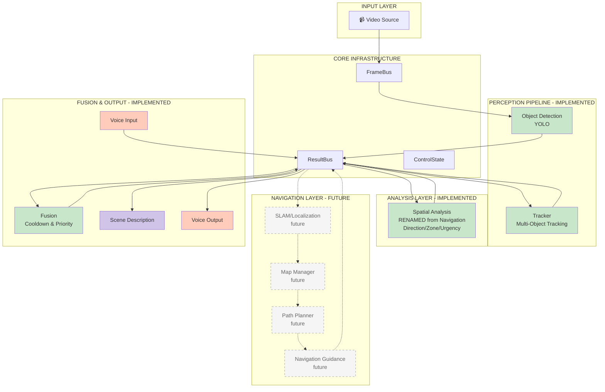

# Architecture Refactoring for Map-Based Navigation Integration

## Problem: Current Naming Conflict

**Current Issue**: The existing "Navigation" module is actually doing **Spatial Object Analysis**, not true navigation (path planning).

**Future Conflict**: When the other team implements map-based navigation, there will be naming collision and confusion.

---

## Solution: Rename and Restructure Now

### Step 1: Rename Current "Navigation" Module

#### Before (Current - Misleading):
```
modules/
├── navigation/              ← MISLEADING NAME!
│   ├── module.py           (Spatial analysis of objects)
│   ├── spatial.py
│   └── guidance.py
```

#### After (Clear and Future-Proof):
```
modules/
├── spatial_analysis/        ← ACCURATE NAME
│   ├── module.py           (Same code, better name)
│   ├── spatial.py
│   └── guidance.py
│
├── navigation/              ← RESERVED for future map-based nav
│   ├── [PLACEHOLDER]
│   └── README.md           (Documents what will go here)
```

---

## Refactoring Plan

### Changes Required:

1. **Rename Directory**: `modules/navigation/` → `modules/spatial_analysis/`
2. **Rename Class**: `NavigationModule` → `SpatialAnalysisModule`
3. **Update Imports**: All files that import from navigation
4. **Update Documentation**: Make clear this is NOT path-planning navigation
5. **Create Placeholder**: Document where map-based navigation will go

---

## Architecture After Refactoring



**Key Points:**
- ✅ **Spatial Analysis** - Current implementation (object-relative positioning)
- 📋 **Navigation Layer** - Future implementation (map-based routing)
- No naming conflicts!

---

## Message Schema Separation

### Current Schema (Keep As-Is)

```python
# contracts/schemas.py

class SpatialGuidance(BaseModel):  # RENAMED from NavigationGuidance
    """
    Spatial analysis of tracked object.
    
    This is NOT navigation routing - just object position analysis.
    Describes where an object is relative to camera/user.
    """
    timestamp_ms: int
    track_id: int
    label: str
    direction: Literal["left", "center", "right"]  # Relative to camera
    zone: Literal["near", "mid", "far"]  # Relative distance
    movement: Literal["approaching", "receding", "stationary"]
    urgency: Literal["low", "medium", "high", "critical"]
    guidance_text: str  # "chair on your right"
```

### Future Schema (Document But Don't Implement)

```python
# contracts/schemas.py (add comments for future)

# ============================================================================
# FUTURE: Map-Based Navigation Schemas
# These will be implemented by the navigation team
# ============================================================================

# class UserLocation(BaseModel):
#     """User position on indoor map (FUTURE)."""
#     timestamp_ms: int
#     x: float  # meters in map coordinate system
#     y: float
#     floor: int
#     heading: float  # degrees
#     confidence: float
#     room_id: Optional[str] = None

# class NavigationRequest(BaseModel):
#     """Request to navigate to destination (FUTURE)."""
#     timestamp_ms: int
#     destination: str  # Room name or ID
#     mode: str  # "fastest", "accessible", "outdoor"

# class NavigationInstruction(BaseModel):
#     """Turn-by-turn navigation instruction (FUTURE)."""
#     timestamp_ms: int
#     instruction_text: str  # "Turn right in 5 meters"
#     distance_to_action_m: float
#     action_type: str  # "turn", "continue", "arrive"
#     next_landmark: Optional[str] = None

# class PlannedRoute(BaseModel):
#     """Planned navigation route (FUTURE)."""
#     timestamp_ms: int
#     waypoints: List[Tuple[float, float]]
#     total_distance_m: float
#     estimated_time_s: float
#     instructions: List[NavigationInstruction]
```

---

## Directory Structure After Refactoring

```
smart-glasses/
├── modules/
│   ├── base.py
│   ├── object_detection/           ✅ Implemented
│   │   ├── module.py
│   │   ├── stub_detector.py
│   │   ├── real_detectors.py
│   │   └── yolo_world_detector.py
│   │
│   ├── tracker/                    ✅ Implemented
│   │   ├── module.py
│   │   └── tracker.py
│   │
│   ├── spatial_analysis/           ✅ Implemented (RENAMED)
│   │   ├── module.py               (SpatialAnalysisModule)
│   │   ├── spatial.py              (Direction, zone, urgency)
│   │   └── guidance.py             (Text generation)
│   │
│   ├── fusion/                     ✅ Implemented
│   │   └── module.py
│   │
│   ├── scene_description/          ✅ Implemented
│   │   └── module.py
│   │
│   ├── voice_input/                ✅ Implemented
│   │   └── module.py
│   │
│   ├── voice_output/               ✅ Implemented
│   │   └── module.py
│   │
│   └── navigation/                 📋 FUTURE (Reserved)
│       ├── README.md               (Design doc - what will go here)
│       ├── slam/                   (Future: Visual odometry)
│       ├── localization/           (Future: Position on map)
│       ├── path_planning/          (Future: A* routing)
│       └── guidance/                (Future: Turn-by-turn)
│
├── data/
│   ├── samples/                    ✅ Existing
│   └── maps/                       📋 FUTURE (Indoor floor plans)
│       └── README.md               (Map format specification)
```

---

## Integration Points for Future Navigation

### 1. Input: User Location

**Future navigation team will publish:**
```python
# Published by SLAM/Localization module (future)
await result_bus.publish(UserLocation(
    timestamp_ms=...,
    x=10.5,  # meters
    y=15.2,
    floor=2,
    heading=45.0,  # degrees
    confidence=0.85
))
```

**Current modules can subscribe (when ready):**
```python
# Any module can subscribe to user location
async for location in result_bus.subscribe_type(UserLocation):
    # Use location data
    pass
```

### 2. Input: Navigation Requests

**Voice Input module already handles this:**
```python
# In voice_input/module.py (already implemented)
# Just need to add new command parsing

elif any(word in command for word in ["take me", "navigate", "go to"]):
    # Extract destination from command
    destination = extract_destination(command)  # "conference room"
    
    # Publish navigation request
    event = ControlEvent(
        kind="navigate_to",  # NEW control event type
        value={"destination": destination}
    )
    await self.result_bus.publish(event)
```

### 3. Output: Navigation Instructions

**Future navigation team will publish:**
```python
# Published by Navigation Guidance module (future)
await result_bus.publish(NavigationInstruction(
    timestamp_ms=...,
    instruction_text="Turn right in 5 meters",
    distance_to_action_m=5.0,
    action_type="turn"
))
```

**Voice Output module will automatically speak it:**
```python
# In voice_output/module.py
# Add subscription to new message type

async def _speak_navigation_instructions(self):
    async for instruction in self.result_bus.subscribe_type(NavigationInstruction):
        if not self.running:
            break
        
        # Speak the instruction
        self.speech_queue.put(instruction.instruction_text)
```

### 4. Integration: Obstacle Avoidance

**Spatial Analysis feeds obstacle info to Navigation:**
```python
# Spatial Analysis publishes (current implementation)
await result_bus.publish(SpatialGuidance(
    track_id=5,
    label="person",
    direction="center",
    zone="near",
    urgency="critical",  # Person blocking path!
    guidance_text="person very close, center"
))

# Navigation's Obstacle Avoidance subscribes (future)
async for spatial in result_bus.subscribe_type(SpatialGuidance):
    if spatial.urgency == "critical" and spatial.direction == "center":
        # Object blocking path - replan!
        await self._replan_around_obstacle(spatial)
```

---

## Updated Module Responsibilities

### Current Implementation (Your Niece's Team) ✅

| Module | Responsibility | Output |
|--------|----------------|--------|
| **Object Detection** | Find objects in frames | `DetectionResult` |
| **Tracker** | Track objects across frames | `TrackUpdate` |
| **Spatial Analysis** | Analyze object positions | `SpatialGuidance` |
| **Fusion** | Prioritize announcements | `FusionAnnouncement` |
| **Scene Description** | Summarize scene | `SceneDescription` |
| **Voice Input** | Recognize commands | `ControlEvent` |
| **Voice Output** | Speak announcements | (Audio output) |

### Future Implementation (Navigation Team) 📋

| Module | Responsibility | Output |
|--------|----------------|--------|
| **SLAM** | Track camera movement | `LocalizationUpdate` |
| **Localization** | Determine position on map | `UserLocation` |
| **Map Manager** | Load/query floor plans | (Map queries) |
| **Path Planner** | Plan route A→B | `PlannedRoute` |
| **Obstacle Avoidance** | Replan around obstacles | `PlannedRoute` (updated) |
| **Nav Guidance** | Generate turn-by-turn | `NavigationInstruction` |

### Integration Points

```
Spatial Analysis → Obstacle Avoidance (future)
   ↓
SpatialGuidance events feed into dynamic replanning

Voice Input → Path Planner (future)
   ↓
Navigation requests trigger route planning

Navigation Guidance (future) → Voice Output
   ↓
Turn-by-turn instructions are spoken
```

---

## Files That Need Updating

### 1. Rename Module Directory
```bash
mv modules/navigation modules/spatial_analysis
```

### 2. Update Module Code
```python
# modules/spatial_analysis/module.py

class SpatialAnalysisModule(BaseModule):  # RENAMED
    """
    Spatial analysis of tracked objects.
    
    Analyzes object positions relative to camera/user:
    - Direction (left, center, right)
    - Zone (near, mid, far)
    - Movement (approaching, receding, stationary)
    - Urgency (low, medium, high, critical)
    
    NOTE: This is NOT navigation (path planning).
    True map-based navigation will be implemented separately.
    """
    name = "SpatialAnalysis"  # RENAMED
    
    # Rest of code stays the same
```

### 3. Update Schema
```python
# contracts/schemas.py

class SpatialGuidance(BaseModel):  # RENAMED from NavigationGuidance
    """
    Spatial analysis of tracked object.
    
    NOTE: This is NOT navigation routing - just object position analysis.
    """
    timestamp_ms: int
    track_id: int
    label: str
    direction: Literal["left", "center", "right"]
    zone: Literal["near", "mid", "far"]
    movement: Literal["approaching", "receding", "stationary"]
    urgency: Literal["low", "medium", "high", "critical"]
    guidance_text: str
```

### 4. Update All Imports
```python
# Before:
from modules.navigation.module import NavigationModule
from contracts.schemas import NavigationGuidance

# After:
from modules.spatial_analysis.module import SpatialAnalysisModule
from contracts.schemas import SpatialGuidance
```

**Files to update:**
- `run_webcam.py`
- `run_webcam_full.py`
- `apps/run_replay.py`
- `tests/test_navigation.py` → `tests/test_spatial_analysis.py`
- `modules/fusion/module.py`
- Any other imports

### 5. Create Navigation Placeholder
```python
# modules/navigation/README.md

"""
Map-Based Navigation Module (FUTURE IMPLEMENTATION)

This module will provide indoor navigation using floor plans and SLAM.

Components to be implemented:
1. SLAM/Localization - Track user position on map
2. Map Manager - Load and query indoor floor plans
3. Path Planner - A* routing from current location to destination
4. Obstacle Avoidance - Dynamic replanning around detected obstacles
5. Navigation Guidance - Turn-by-turn instructions

Integration Points:
- Subscribes to: TrackUpdate (for obstacles), SpatialGuidance (for hazards)
- Publishes: UserLocation, PlannedRoute, NavigationInstruction

See: /docs/MAP_BASED_NAVIGATION.md for complete design
"""
```

---

## Benefits of This Refactoring

### ✅ Clear Separation of Concerns
- **Spatial Analysis**: Object-relative positioning (implemented)
- **Navigation**: Map-based routing (future)
- No confusion about what does what

### ✅ No Breaking Changes Later
- When navigation team implements their modules, no conflicts
- Just add new modules, don't rename/refactor existing ones

### ✅ Clear Integration Points
- ResultBus messages define interface
- Both teams can work independently
- Plug-and-play integration

### ✅ Better Documentation
- Names accurately describe functionality
- Future developers understand architecture
- Code is self-documenting

---

## Testing the Refactoring

After renaming, verify everything still works:

```bash
# 1. Run tests
pytest tests/

# 2. Test webcam mode
python3 run_webcam_full.py

# 3. Check logs for correct module names
# Should see: "SpatialAnalysis module started"
# NOT: "Navigation module started"

# 4. Verify announcements still work
# Should hear: "chair on your right"
```

---

## Summary

### What We're Doing Now:
1. ✅ **Rename** `NavigationModule` → `SpatialAnalysisModule`
2. ✅ **Rename** `NavigationGuidance` → `SpatialGuidance`
3. ✅ **Reserve** `modules/navigation/` for future implementation
4. ✅ **Document** integration points for navigation team
5. ✅ **Update** all imports and references

### What This Enables:
- 🎯 Navigation team can implement independently
- 🎯 No naming conflicts or refactoring later
- 🎯 Clear interface via ResultBus messages
- 🎯 Seamless integration when ready

### Effort Required:
- **2-3 hours** for renaming and testing
- **Low risk** - just renaming, same logic
- **High value** - prevents future conflicts

---

Want me to create a pull request with all the renaming changes?

