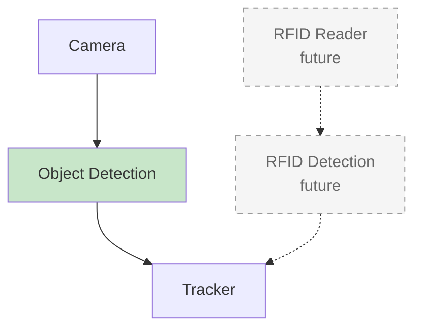
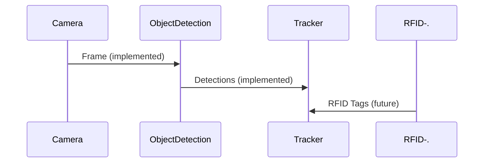

# Diagram Legend - Smart Glasses System

## Visual Conventions

### Box Styles

#### ✅ Implemented & Working Components
```
┌─────────────────────────┐
│ Solid border            │
│ Full color              │
│ Normal text             │
└─────────────────────────┘
```
- **Appearance**: Solid border, vibrant colors
- **Meaning**: Fully implemented, tested, and working
- **Examples**: Object Detection, Tracker, Navigation, Voice Output

#### 📋 Future/Planned Components
```
┌ ─ ─ ─ ─ ─ ─ ─ ─ ─ ─ ─ ┐
  Dotted/dashed border
│ Muted gray color        │
  Gray text
└ ─ ─ ─ ─ ─ ─ ─ ─ ─ ─ ─ ┘
```
- **Appearance**: Dashed border, light gray fill, muted text
- **Meaning**: Designed but not yet implemented
- **Examples**: RFID Reader, Sensor Fusion, Web UI (frontend)
- **Label**: Often marked with "future" or "planned"

---

### Connection Styles

#### Solid Lines (→)
```
[Component A] ───→ [Component B]
```
- **Meaning**: Active data flow between implemented components
- **Example**: Camera → FrameBus → ObjectDetection

#### Dashed Lines (-.→)
```
[Component A] ─ ─→ [Component B]
```
- **Meaning**: Planned data flow or connections to future components
- **Example**: RFID Reader -.→ RFID Detection Module

#### Dotted Lines (Configuration)
```
[ControlState] ··→ [Module]
```
- **Meaning**: Configuration/control relationship (read-only)
- **Example**: ControlState provides settings to all modules

---

### Color Coding

| Color | Meaning | Components |
|-------|---------|------------|
| 🟦 **Blue** (`#e1f5ff`) | Infrastructure - Buses | FrameBus |
| 🟨 **Yellow** (`#fff4e1`) | Infrastructure - Event System | ResultBus |
| ⬜ **Gray** (`#f0f0f0`) | Infrastructure - State | ControlState |
| 🟩 **Green** (`#c8e6c9`) | Processing - Computer Vision | Object Detection, Tracker, Navigation, Fusion |
| 🟧 **Orange** (`#ffccbc`) | Interface - Voice | Voice Input, Voice Output |
| 🟪 **Purple** (`#d1c4e9`) | Interface - Visual | Scene Description |
| ⬜ **Light Gray** (`#f5f5f5`) | **Future/Planned** | Any component not yet built |

---

### Text Labels

#### Status Indicators
- **No label** or **bold name**: Fully implemented
- **"future"**: Planned for future development
- **"partial"**: Partially implemented (some features working)
- **"experimental"**: Working but not production-ready

#### Examples:
```
[📹 Camera Source]                    ← Fully working
[📡 RFID Reader - future]             ← Not implemented yet
[📺 Web UI - partial]                 ← Backend exists, frontend planned
```

---

## Reading the Diagrams

### Example 1: Main System Architecture



**What you see:**
- **Camera → Object Detection**: Solid line, full color = Working now ✅
- **RFID Reader → RFID Detection**: Dashed line, gray box = Future 📋
- **Object Detection → Tracker**: Solid line = Working now ✅
- **RFID Detection → Tracker**: Dashed line = Future integration 📋

**What it means:**
- You can use camera and object detection today
- RFID is planned but not available yet
- Tracker works with current visual data
- Future: Tracker will also handle RFID data

---

### Example 2: Data Flow Sequence



**What you see:**
- **Solid arrows**: Working data flow
- **Dotted arrows**: Planned data flow

---

## Quick Reference

### Ask Yourself:
1. **Is the box solid or dashed?**
   - Solid = Works now ✅
   - Dashed = Planned 📋

2. **Is the box colorful or gray?**
   - Colorful = Implemented ✅
   - Gray = Future 📋

3. **Are the connections solid or dashed?**
   - Solid = Active data flow ✅
   - Dashed = Planned flow 📋

4. **Does it say "future"?**
   - Yes = Don't expect it to work yet 📋
   - No = Should work now ✅

---

## Module Status at a Glance

### ✅ What Works Now (Solid Boxes)
- Camera/Video Source
- FrameBus, ResultBus, ControlState
- Object Detection (YOLO)
- Tracker
- Navigation
- Fusion
- Scene Description
- Voice Input
- Voice Output

### 📋 What's Planned (Dashed Boxes)
- RFID Reader hardware
- RFID Detection module
- Sensor Fusion (Visual + RFID)
- Web UI frontend
- Advanced features (SLAM, OCR, etc.)

### 🚧 What's Partial (Mixed)
- Web UI backend (exists but incomplete)

---

## Tips for Understanding Diagrams

1. **Start with solid boxes** - These are what you can use today
2. **Ignore dashed boxes initially** - They're for planning, not current functionality
3. **Follow solid lines** - These show the actual data flow
4. **Check labels** - "future" means it's designed but not built

---

## Common Questions

**Q: Can I use the RFID Reader?**
A: No, it's shown with a dashed box and marked "future" - not implemented yet.

**Q: Does Object Detection work?**
A: Yes, it's shown with a solid box and full color - fully implemented with YOLO.

**Q: What does a dashed arrow mean?**
A: It shows a planned connection that will work once the future components are implemented.

**Q: Can I use the Web UI?**
A: Partially - the backend exists but the frontend (browser interface) is not built yet.

---

## Diagram Evolution

As components are implemented, you'll see them change:

**Before implementation:**
```
┌ ─ ─ ─ ─ ─ ─ ─ ─ ─ ─ ─ ┐
  RFID Detection
│ future                  │
└ ─ ─ ─ ─ ─ ─ ─ ─ ─ ─ ─ ┘
```

**After implementation:**
```
┌─────────────────────────┐
│ RFID Detection          │
│ ✓ IMPLEMENTED           │
└─────────────────────────┘
```

The dashed border becomes solid, gray becomes colorful, and "future" is removed!

---

**Last Updated**: 2025-12-27  
**Purpose**: Help readers quickly identify what's real vs what's planned in system diagrams

