# Map-Based Indoor Navigation Integration

## Current vs Required Navigation

### What's Currently Implemented ❌ (Wrong for Your Needs)

**Current "Navigation" Module** = Spatial Object Analysis
```python
Input: TrackUpdate(track_id=5, label="chair", bbox=(0.7, 0.5, 0.2, 0.3))
Processing: 
  - Direction: "right" (from camera perspective)
  - Zone: "far" (based on bbox size)
  - Movement: "stationary"
Output: "chair ahead on right"
```

**Problem**: No concept of:
- Where the user is in the building
- Where they want to go
- What the layout is
- How to navigate to a destination

---

### What You Actually Need ✅ (Map-Based Navigation)

**Map-Based Navigation** = Indoor Positioning + Path Planning
```python
Input: 
  - User location: "Room 205, coordinates (10.5, 15.2)"
  - Destination: "Room 301"
  - Indoor map: Floor plan with hallways, rooms, obstacles
  - Detected objects: Chair, person, door

Processing:
  - Localize user on map
  - Plan path from 205 → 301
  - Avoid detected obstacles
  - Give turn-by-turn directions

Output: "Walk forward 5 meters, turn right at the door, then left at the hallway"
```

---

## Architecture Impact

### Current Architecture (Object-Centric)
```mermaid
graph LR
    CAM[Camera] --> OD[Object Detection]
    OD --> TR[Tracker]
    TR --> NAV[Spatial Analysis<br/>Current "Navigation"]
    NAV --> FUS[Fusion]
    FUS --> VO[Voice Output]
    
    style NAV fill:#ffcccc
```

### Required Architecture (Map-Centric + Object-Aware)


**Key Changes**:
1. Current "Navigation" renamed to "ObjectAnalysis" or "SpatialAnalysis"
2. New Localization Layer added
3. New Navigation Layer added (the REAL navigation)
4. Object detection feeds into obstacle avoidance

---

## Component Breakdown

### Layer 1: Localization (Know Where You Are)

#### SLAM Module (Visual Odometry)
```python
class SLAMModule(BaseModule):
    """
    Visual SLAM for indoor localization.
    
    Uses camera frames to track user movement and build/update map.
    Technologies: ORB-SLAM3, RTAB-Map, or similar.
    """
    name = "SLAM"
    
    def __init__(self, map_file: Optional[str] = None):
        self.slam_system = ORBSLAM3()  # Or other SLAM library
        self.map_file = map_file
        self.current_pose = None  # (x, y, theta)
        self.map_points = []  # 3D map points
    
    async def _process_frames(self):
        async for frame in self.frame_bus.subscribe():
            # Run SLAM on frame
            pose, map_points = self.slam_system.track_frame(
                frame.jpg_bytes,
                frame.timestamp_ms
            )
            
            self.current_pose = pose
            self.map_points = map_points
            
            # Publish localization update
            await self.result_bus.publish(LocalizationUpdate(
                timestamp_ms=frame.timestamp_ms,
                x=pose.x,
                y=pose.y,
                theta=pose.theta,
                confidence=pose.confidence,
                method="visual_slam"
            ))
```

**Alternatives to Visual SLAM**:
- WiFi/BLE beacon triangulation
- IMU + Step counting (dead reckoning)
- Wheel odometry (if using robot platform)
- Hybrid (combine multiple sources)

---

#### Localization Module (Fuse Position Estimates)
```python
class LocalizationModule(BaseModule):
    """
    Fuses multiple positioning sources to estimate user location on map.
    
    Combines:
    - Visual SLAM
    - WiFi positioning
    - IMU data
    - Compass
    """
    name = "Localization"
    
    def __init__(self):
        self.position_estimates = []
        self.current_position = None
        self.current_floor = None
    
    async def start(self, frame_bus, result_bus, control_state):
        tasks = [
            asyncio.create_task(self._fuse_slam_data()),
            asyncio.create_task(self._fuse_wifi_data()),
            asyncio.create_task(self._fuse_imu_data()),
        ]
        return tasks
    
    async def _fuse_slam_data(self):
        async for slam_update in self.result_bus.subscribe_type(LocalizationUpdate):
            # Add SLAM estimate
            self.position_estimates.append({
                'source': 'slam',
                'position': (slam_update.x, slam_update.y),
                'confidence': slam_update.confidence,
                'timestamp': slam_update.timestamp_ms
            })
            
            # Fuse all estimates (weighted average, Kalman filter, etc.)
            self.current_position = self._fuse_positions()
            
            # Publish fused position
            await self.result_bus.publish(UserPosition(
                timestamp_ms=int(time.time() * 1000),
                x=self.current_position[0],
                y=self.current_position[1],
                floor=self.current_floor,
                heading=self.current_heading,
                confidence=self._compute_confidence()
            ))
```

---

#### Map Manager
```python
class MapManager(BaseModule):
    """
    Loads and manages indoor maps (floor plans).
    
    Map format: GeoJSON, OSM Indoor, or custom format
    """
    name = "MapManager"
    
    def __init__(self, map_directory: str):
        self.map_directory = map_directory
        self.maps = {}  # floor_id -> Map object
        self.current_map = None
    
    def load_map(self, building_id: str, floor: int):
        """Load floor plan for specific building/floor."""
        map_file = f"{self.map_directory}/{building_id}_floor_{floor}.json"
        
        with open(map_file) as f:
            map_data = json.load(f)
        
        self.maps[floor] = IndoorMap(
            floor=floor,
            rooms=map_data['rooms'],
            hallways=map_data['hallways'],
            doors=map_data['doors'],
            obstacles=map_data['static_obstacles'],
            waypoints=map_data['waypoints']
        )
        
        return self.maps[floor]
    
    def query_nearest_room(self, x: float, y: float) -> str:
        """Find which room user is in."""
        for room in self.current_map.rooms:
            if room.contains_point(x, y):
                return room.name
        return "hallway"
    
    def query_path_exists(self, from_room: str, to_room: str) -> bool:
        """Check if path exists between rooms."""
        return self.current_map.graph.has_path(from_room, to_room)
```

**Map Format Example** (GeoJSON-like):
```json
{
  "building": "Engineering Building",
  "floor": 2,
  "coordinate_system": "local_meters",
  "origin": [0, 0],
  "rooms": [
    {
      "id": "room_205",
      "name": "Lab 205",
      "type": "laboratory",
      "polygon": [[10.0, 15.0], [20.0, 15.0], [20.0, 25.0], [10.0, 25.0]],
      "doors": [
        {"position": [15.0, 15.0], "connects_to": "hallway_main"}
      ]
    },
    {
      "id": "room_301",
      "name": "Conference Room",
      "type": "meeting",
      "polygon": [[30.0, 40.0], [45.0, 40.0], [45.0, 50.0], [30.0, 50.0]],
      "doors": [
        {"position": [37.5, 40.0], "connects_to": "hallway_main"}
      ]
    }
  ],
  "hallways": [
    {
      "id": "hallway_main",
      "type": "corridor",
      "centerline": [[15.0, 0.0], [15.0, 30.0], [40.0, 30.0], [40.0, 60.0]],
      "width": 2.5
    }
  ],
  "waypoints": [
    {"id": "wp_1", "position": [15.0, 20.0], "description": "Near Lab 205 door"},
    {"id": "wp_2", "position": [15.0, 30.0], "description": "Hallway intersection"},
    {"id": "wp_3", "position": [37.5, 40.0], "description": "Conference room entrance"}
  ]
}
```

---

### Layer 2: Navigation (Path Planning + Guidance)

#### Path Planner Module
```python
class PathPlannerModule(BaseModule):
    """
    Plans optimal path from user location to destination.
    
    Algorithms: A*, Dijkstra, RRT, or similar
    """
    name = "PathPlanner"
    
    def __init__(self, map_manager: MapManager):
        self.map_manager = map_manager
        self.current_path = None
        self.destination = None
    
    async def start(self, frame_bus, result_bus, control_state):
        tasks = [
            asyncio.create_task(self._listen_for_destinations()),
            asyncio.create_task(self._replan_on_position_update()),
        ]
        return tasks
    
    async def _listen_for_destinations(self):
        """Listen for navigation requests from user."""
        async for nav_request in self.result_bus.subscribe_type(NavigationRequest):
            # User said "Take me to conference room"
            self.destination = nav_request.destination_room
            
            # Get current position
            current_pos = await self._get_current_position()
            
            # Plan path using A*
            path = self._plan_path(
                from_pos=current_pos,
                to_room=self.destination,
                map_obj=self.map_manager.current_map
            )
            
            self.current_path = path
            
            # Publish path
            await self.result_bus.publish(PlannedPath(
                timestamp_ms=int(time.time() * 1000),
                waypoints=path.waypoints,
                total_distance_m=path.distance,
                estimated_time_s=path.distance / 1.2,  # Assume 1.2 m/s walking
                destination=self.destination
            ))
    
    def _plan_path(self, from_pos, to_room, map_obj):
        """A* path planning on map graph."""
        # Convert map to graph
        graph = self._map_to_graph(map_obj)
        
        # Find path using A*
        start_node = self._nearest_node(from_pos, graph)
        goal_node = self._room_to_node(to_room, graph)
        
        path = a_star_search(graph, start_node, goal_node)
        
        return Path(
            waypoints=path,
            distance=self._compute_distance(path)
        )
```

---

#### Obstacle Avoidance Module (Dynamic Replanning)
```python
class ObstacleAvoidanceModule(BaseModule):
    """
    Monitors for dynamic obstacles and replans path if needed.
    
    Combines:
    - Static map obstacles
    - Dynamic detected objects (from Tracker)
    - Predicted object trajectories
    """
    name = "ObstacleAvoidance"
    
    def __init__(self):
        self.static_obstacles = []
        self.dynamic_obstacles = []
        self.current_path = None
    
    async def start(self, frame_bus, result_bus, control_state):
        tasks = [
            asyncio.create_task(self._monitor_detected_objects()),
            asyncio.create_task(self._check_path_blocked()),
        ]
        return tasks
    
    async def _monitor_detected_objects(self):
        """Track dynamic obstacles from object detection."""
        async for track in self.result_bus.subscribe_type(TrackUpdate):
            # Only care about obstacles in path
            if not self.current_path:
                continue
            
            # Check if object is blocking path
            if self._is_blocking_path(track, self.current_path):
                # Trigger replan
                await self.result_bus.publish(PathBlockedEvent(
                    timestamp_ms=int(time.time() * 1000),
                    blocking_object=track.label,
                    position=(track.bbox[0], track.bbox[1]),
                    action="replan"
                ))
    
    def _is_blocking_path(self, track, path):
        """Check if detected object blocks planned path."""
        # Convert track bbox to map coordinates
        obj_map_pos = self._camera_to_map_coords(track.bbox)
        
        # Check if object intersects path
        for segment in path.segments:
            if segment.intersects(obj_map_pos, buffer=0.5):  # 50cm buffer
                return True
        
        return False
```

---

#### Guidance Generator Module
```python
class GuidanceGeneratorModule(BaseModule):
    """
    Generates turn-by-turn navigation instructions.
    
    Input: Current position + Planned path
    Output: "Walk forward 5 meters, then turn right"
    """
    name = "GuidanceGenerator"
    
    def __init__(self):
        self.current_path = None
        self.current_position = None
        self.current_instruction_index = 0
    
    async def start(self, frame_bus, result_bus, control_state):
        tasks = [
            asyncio.create_task(self._update_guidance()),
        ]
        return tasks
    
    async def _update_guidance(self):
        """Generate guidance based on position and path."""
        while self.running:
            await asyncio.sleep(0.5)  # Update every 500ms
            
            if not self.current_path or not self.current_position:
                continue
            
            # Find next waypoint
            next_waypoint = self._get_next_waypoint()
            
            if not next_waypoint:
                # Reached destination
                await self.result_bus.publish(NavigationGuidance(
                    timestamp_ms=int(time.time() * 1000),
                    text="You have arrived at your destination",
                    instruction_type="arrival",
                    distance_to_next_m=0.0
                ))
                continue
            
            # Calculate distance and direction to next waypoint
            distance = self._distance_to_waypoint(self.current_position, next_waypoint)
            direction = self._direction_to_waypoint(self.current_position, next_waypoint)
            
            # Generate instruction
            if distance < 1.0:
                # Close to waypoint, give turning instruction
                instruction = self._generate_turn_instruction(next_waypoint)
            else:
                # Still walking to waypoint
                instruction = f"Continue {direction} for {distance:.0f} meters"
            
            # Publish guidance
            await self.result_bus.publish(NavigationGuidance(
                timestamp_ms=int(time.time() * 1000),
                text=instruction,
                instruction_type="navigation",
                distance_to_next_m=distance,
                heading_deg=self._calculate_heading(direction)
            ))
    
    def _generate_turn_instruction(self, waypoint):
        """Generate turn instruction at waypoint."""
        if waypoint.action == "turn_right":
            return "Turn right ahead"
        elif waypoint.action == "turn_left":
            return "Turn left ahead"
        elif waypoint.action == "door":
            return "Go through the door ahead"
        elif waypoint.action == "stairs":
            return "Take the stairs ahead"
        else:
            return "Continue forward"
```

---

## Complete Map-Based Navigation Flow

```mermaid
sequenceDiagram
    participant User
    participant Voice as Voice Input
    participant Loc as Localization
    participant Map as Map Manager
    participant Path as Path Planner
    participant Cam as Camera
    participant OD as Object Detection
    participant Obs as Obstacle Avoidance
    participant Guide as Guidance Generator
    participant TTS as Voice Output
    
    Note over User,TTS: User starts navigation
    
    User->>Voice: "Take me to conference room"
    Voice->>Path: NavigationRequest(destination="Conference Room")
    
    Path->>Loc: Get current position
    Loc-->>Path: UserPosition(x=10.5, y=15.2, floor=2)
    
    Path->>Map: Query path from Lab 205 to Conference Room
    Map-->>Path: Map graph with waypoints
    
    Path->>Path: A* planning
    Path->>Guide: PlannedPath(waypoints=[...])
    
    Note over User,TTS: User starts walking
    
    loop Every frame
        Cam->>OD: Frame
        OD->>Obs: DetectedObjects
        
        Obs->>Obs: Check if objects block path
        
        alt Path blocked
            Obs->>Path: PathBlockedEvent
            Path->>Path: Replan around obstacle
            Path->>Guide: UpdatedPath
        end
    end
    
    loop Every 500ms
        Guide->>Loc: Get current position
        Loc-->>Guide: UserPosition(x=12.3, y=16.8)
        
        Guide->>Guide: Calculate next instruction
        Guide->>TTS: "Walk forward 3 meters"
        TTS-->>User: 🔊 Audio guidance
    end
    
    Note over User,TTS: User reaches destination
    
    Guide->>TTS: "You have arrived"
    TTS-->>User: 🔊 "You have arrived at Conference Room"
```



---

## Integration with Existing System

### What Gets Renamed/Repurposed

#### Current "Navigation" Module → "SpatialAnalysis" Module
```python
# OLD NAME (misleading)
class NavigationModule:
    """Analyzes object positions relative to camera."""
    pass

# NEW NAME (accurate)
class SpatialAnalysisModule:
    """
    Analyzes detected objects for spatial relationships.
    
    This is NOT path-planning navigation, just object analysis.
    Feeds into obstacle avoidance and fusion.
    """
    pass
```

---

### New Message Schemas

```python
# contracts/schemas.py

class LocalizationUpdate(BaseModel):
    """User position estimate from SLAM/sensors."""
    timestamp_ms: int
    x: float  # meters in map coordinate system
    y: float  # meters in map coordinate system
    floor: int
    theta: float  # heading in radians
    confidence: float  # 0.0 to 1.0
    method: str  # "visual_slam", "wifi", "imu", "fused"


class UserPosition(BaseModel):
    """Fused user position on map."""
    timestamp_ms: int
    x: float
    y: float
    floor: int
    heading: float  # degrees, 0=north
    confidence: float
    room_id: Optional[str] = None  # Which room user is in
    nearest_landmark: Optional[str] = None


class NavigationRequest(BaseModel):
    """User request to navigate somewhere."""
    timestamp_ms: int
    destination_room: str  # "Conference Room" or "room_301"
    destination_type: str  # "room", "landmark", "coordinates"
    destination_coords: Optional[Tuple[float, float]] = None
    avoid_stairs: bool = False
    accessibility_mode: bool = False


class PlannedPath(BaseModel):
    """Planned navigation path."""
    timestamp_ms: int
    waypoints: List[Tuple[float, float]]  # (x, y) in map coords
    instructions: List[str]  # Turn-by-turn text
    total_distance_m: float
    estimated_time_s: float
    destination: str


class PathBlockedEvent(BaseModel):
    """Dynamic obstacle blocking path."""
    timestamp_ms: int
    blocking_object: str  # Object label
    position: Tuple[float, float]  # In map coords
    action: str  # "replan", "wait", "warn"


class NavigationGuidance(BaseModel):
    """Turn-by-turn guidance instruction."""
    timestamp_ms: int
    text: str  # "Turn right in 5 meters"
    instruction_type: str  # "continue", "turn", "arrival", "warning"
    distance_to_next_m: float
    heading_deg: float  # Direction to face
    next_landmark: Optional[str] = None
```

---

## Data Directory Structure

```
smart-glasses/
├── data/
│   ├── maps/                           # Indoor maps
│   │   ├── engineering_building/
│   │   │   ├── floor_1.json           # Floor 1 layout
│   │   │   ├── floor_2.json           # Floor 2 layout
│   │   │   ├── floor_3.json
│   │   │   └── metadata.json          # Building info
│   │   ├── library/
│   │   │   ├── floor_1.json
│   │   │   └── floor_2.json
│   │   └── student_center/
│   │       └── floor_1.json
│   ├── slam/                          # SLAM data
│   │   ├── vocabulary.txt             # ORB vocabulary
│   │   ├── saved_maps/                # Saved SLAM maps
│   │   └── calibration/               # Camera calibration
│   └── samples/                       # Test videos (existing)
```

---

## Implementation Phases

### Phase 0: Current State ✅
- Object detection working
- Tracking working
- Spatial analysis working (misnamed "Navigation")
- Voice interface working

### Phase 1: Basic Localization (4-6 weeks)
1. **Rename** current Navigation → SpatialAnalysis
2. **Implement** SLAM module (ORB-SLAM3 or RTAB-Map)
3. **Create** simple test map (single floor, few rooms)
4. **Test** localization accuracy

### Phase 2: Path Planning (2-3 weeks)
1. **Implement** MapManager (load/query maps)
2. **Implement** PathPlanner (A* algorithm)
3. **Create** map format specification
4. **Test** path planning on test map

### Phase 3: Navigation Guidance (2-3 weeks)
1. **Implement** GuidanceGenerator
2. **Integrate** with voice output
3. **Test** turn-by-turn instructions
4. **User testing** with blind users

### Phase 4: Obstacle Avoidance (2-3 weeks)
1. **Implement** ObstacleAvoidance module
2. **Integrate** with SpatialAnalysis (renamed Navigation)
3. **Test** dynamic replanning
4. **Handle** edge cases (blocked paths, detours)

### Phase 5: Polish & Optimization (2-4 weeks)
1. **Multi-floor** navigation
2. **Accessibility** features (avoid stairs option)
3. **Performance** optimization
4. **Error handling** (lost localization, no map, etc.)

**Total Estimated Time**: 12-19 weeks (3-5 months)

---

## Challenges & Solutions

### Challenge 1: Localization Accuracy
**Problem**: Visual SLAM can drift, especially in texture-less environments

**Solutions**:
- Use multiple localization sources (WiFi, IMU, beacons)
- Loop closure detection
- Map-based localization (match visual features to known map)
- Periodic recalibration at known landmarks

### Challenge 2: Map Creation
**Problem**: Need accurate floor plans for each building

**Solutions**:
- Partner with facility management for CAD drawings
- Use existing building information models (BIM)
- SLAM mapping phase (user walks building to create map)
- Crowdsourced mapping

### Challenge 3: Computational Cost
**Problem**: SLAM + Object Detection + Navigation is CPU-intensive

**Solutions**:
- Run SLAM at lower frame rate (10 fps instead of 30 fps)
- Use lightweight SLAM (ORB-SLAM Lite)
- Offload to edge server (if available)
- Use visual odometry only, periodic map matching

### Challenge 4: Indoor GPS Alternative
**Problem**: No GPS indoors for absolute positioning

**Solutions**:
- WiFi positioning (measure signal strength from APs)
- BLE beacons (placed at known locations)
- QR code landmarks (scan codes to recalibrate)
- Visual landmarks (detect known objects/signs)

---

## Comparison: Current vs Map-Based

| Aspect | Current System | Map-Based System |
|--------|----------------|------------------|
| **User Location** | Unknown | Known (x, y, floor) |
| **Destination** | N/A | User specifies room/landmark |
| **Path Planning** | None | A* on map graph |
| **Guidance** | "Chair on right" | "Turn right in 5 meters" |
| **Obstacles** | Detected and announced | Detected and avoided/replanned |
| **Use Case** | Immediate hazard awareness | Point-to-point navigation |
| **Complexity** | Low | High |
| **Requirements** | Camera only | Camera + IMU + Maps + SLAM |

---

## Recommendation

### Option A: Incremental Approach (Recommended)
1. **Keep** current system as "Hazard Awareness" mode
2. **Add** map-based navigation as separate "Navigation" mode
3. **User switches** between modes:
   - "Hazard mode": Announces nearby objects (current system)
   - "Navigate mode": Turn-by-turn to destination (new system)

**Benefits**:
- Both modes useful for different scenarios
- Can develop incrementally
- Fallback if navigation fails

### Option B: Replace Entirely
1. **Replace** current system with map-based navigation
2. **Integrate** object detection as obstacle avoidance only

**Drawbacks**:
- Lose useful hazard awareness feature
- All-or-nothing approach
- Higher risk

---

## Summary

### What You Need for Map-Based Navigation:

1. **Indoor Maps** (floor plans in GeoJSON or similar)
2. **Localization** (SLAM or alternative positioning)
3. **Path Planning** (A* algorithm on map graph)
4. **Guidance Generation** (turn-by-turn instructions)
5. **Obstacle Avoidance** (dynamic replanning)

### How It Fits in Architecture:

- **Current "Navigation"**: Rename to "SpatialAnalysis"
- **New Localization Layer**: SLAM + MapManager
- **New Navigation Layer**: PathPlanner + GuidanceGenerator
- **Modified Fusion**: Combine object hazards + navigation instructions

### Effort Required:

- **12-19 weeks** for full implementation
- **Significant complexity** increase
- **New dependencies** (SLAM library, map data)
- **Hardware requirements** (IMU, possibly beacons)

### My Recommendation:

**Keep both systems**:
1. Current system = "Hazard Awareness Mode" (simple, works now)
2. New system = "Navigation Mode" (complex, point-to-point routing)

This gives users maximum flexibility and provides a fallback if navigation fails!

---

Does this clarify how map-based navigation would fit in? It's a major addition but the modular architecture makes it possible to integrate without breaking existing functionality.

