# Adding RFID Detection to the Pipeline

## Your Question: Is RFID part of Object Detection or separate?

**Answer: RFID would be a SEPARATE, PARALLEL detection module.**

Here's why and how it would work:

---

## Architecture: Visual + RFID Detection

```mermaid
graph TB
    subgraph "Input Sources"
        CAM[📹 Camera<br/>Visual Data]
        RFID_HW[📡 RFID Reader<br/>RF Signals]
    end
    
    subgraph "Detection Layer (Parallel)"
        OD[👁️ Visual Detection<br/>YOLO on frames]
        RFID[📡 RFID Detection<br/>Tag scanning]
    end
    
    subgraph "Core Infrastructure"
        FB[FrameBus<br/>Video frames]
        RB[ResultBus<br/>All events]
    end
    
    subgraph "Fusion & Processing"
        TR[🎯 Tracker<br/>Multi-Modal Tracking]
        SENSOR_FUS[🔀 Sensor Fusion<br/>Combine Visual + RFID]
        NAV[🧭 Navigation]
        FUS[🔀 Final Fusion]
    end
    
    CAM --> FB
    FB --> OD
    
    RFID_HW --> RFID
    
    OD -->|VisualDetection| RB
    RFID -->|RFIDDetection| RB
    
    RB --> SENSOR_FUS
    SENSOR_FUS -->|FusedDetection| RB
    
    RB --> TR
    TR --> RB
    RB --> NAV
    NAV --> RB
    RB --> FUS

    style OD fill:#c8e6c9
    style RFID fill:#c8e6c9
    style SENSOR_FUS fill:#ffb74d
    style TR fill:#81c784
    style NAV fill:#81c784
    style FUS fill:#81c784
```



---

## Why RFID is Separate from Object Detection

### Different Sensing Modalities

| Aspect | Visual Detection (YOLO) | RFID Detection |
|--------|-------------------------|----------------|
| **Input** | Video frames (pixels) | Radio frequency signals |
| **Subscribes To** | FrameBus | Nothing (hardware polling) |
| **What It Detects** | Any visible object (80+ classes) | Only tagged objects |
| **Detection Method** | Deep learning on images | RFID tag ID reading |
| **Range** | Depends on camera (3-30 feet) | Depends on reader (1-10 feet) |
| **Accuracy** | 40-90% depending on object | 99%+ (if tag present) |
| **Location Info** | Precise 2D bbox in image | Approximate distance only |
| **Works In Dark** | No | Yes |
| **Occlusion** | Problem | Not a problem |

### Key Differences:

**Visual Detection:**
- Sees EVERYTHING in field of view
- Can detect unlabeled objects
- Provides visual location (where in image)
- Requires line of sight

**RFID Detection:**
- Only detects tagged objects
- Cannot detect untagged objects
- Provides distance but not direction
- Works through walls/obstacles

---

## Implementation: RFID Detection Module

### 1. New Message Schema

```python
# contracts/schemas.py

class RFIDDetection(BaseModel):
    """RFID tag detection event."""
    timestamp_ms: int
    tag_id: str = Field(..., description="Unique RFID tag identifier")
    object_label: str = Field(..., description="What this tag represents (e.g., 'keys', 'wallet')")
    signal_strength: float = Field(..., ge=0.0, le=100.0, description="RSSI signal strength")
    estimated_distance_cm: Optional[float] = Field(None, description="Estimated distance in cm")
    reader_id: str = Field(default="reader_0", description="Which RFID reader detected this")
```

### 2. RFID Detection Module

```python
# modules/rfid_detection/module.py

import asyncio
import logging
from typing import List, Optional, Dict
from modules.base import BaseModule
from contracts.schemas import RFIDDetection
from core_platform.result_bus import ResultBus
from core_platform.control_state import ControlState

logger = logging.getLogger(__name__)

try:
    from modules.rfid_detection.rfid_reader import RFIDReader
    RFID_AVAILABLE = True
except ImportError:
    RFID_AVAILABLE = False
    logger.warning("RFID reader library not available")


class RFIDDetectionModule(BaseModule):
    """
    RFID Detection Module - Detects tagged objects.
    
    This module runs INDEPENDENTLY of visual detection.
    It polls the RFID reader hardware for nearby tags.
    
    Use cases:
    - Find lost keys (tagged with RFID)
    - Locate wallet, phone, glasses
    - Identify specific items in environment
    - Work in darkness (unlike vision)
    """
    
    name = "RFIDDetection"
    
    def __init__(
        self,
        enabled: bool = True,
        poll_interval_ms: int = 200,  # Poll RFID reader every 200ms
        tag_mapping: Optional[Dict[str, str]] = None  # tag_id -> object_label
    ):
        """
        Initialize RFID detection module.
        
        Args:
            enabled: Whether RFID detection is enabled
            poll_interval_ms: How often to poll RFID reader
            tag_mapping: Map RFID tag IDs to object labels
                Example: {"E200001234567890": "keys", "E200001234567891": "wallet"}
        """
        self.enabled = enabled and RFID_AVAILABLE
        self.poll_interval_ms = poll_interval_ms
        self.tag_mapping = tag_mapping or {}
        
        if self.enabled:
            self.reader = RFIDReader()
        
        self.running = False
        self.result_bus: Optional[ResultBus] = None
        self.control_state: Optional[ControlState] = None
    
    async def start(
        self,
        frame_bus,  # NOT USED! RFID doesn't need video frames
        result_bus: ResultBus,
        control_state: ControlState,
    ) -> List[asyncio.Task]:
        """Start the RFID detection module."""
        if not self.enabled:
            logger.info(f"{self.name} module disabled")
            return []
        
        self.result_bus = result_bus
        self.control_state = control_state
        self.running = True
        
        # Start polling task
        task = asyncio.create_task(self._poll_rfid_reader())
        logger.info(f"{self.name} module started (poll interval: {self.poll_interval_ms}ms)")
        return [task]
    
    async def _poll_rfid_reader(self) -> None:
        """Continuously poll RFID reader for nearby tags."""
        try:
            while self.running:
                if self.control_state.paused:
                    await asyncio.sleep(0.1)
                    continue
                
                # Poll RFID reader (this is synchronous hardware I/O)
                tags = await asyncio.to_thread(self.reader.read_tags)
                
                # Publish detection for each tag found
                for tag in tags:
                    object_label = self.tag_mapping.get(tag.id, f"unknown_object_{tag.id[:8]}")
                    
                    detection = RFIDDetection(
                        timestamp_ms=int(time.time() * 1000),
                        tag_id=tag.id,
                        object_label=object_label,
                        signal_strength=tag.rssi,
                        estimated_distance_cm=self._estimate_distance(tag.rssi),
                        reader_id="reader_0"
                    )
                    
                    await self.result_bus.publish(detection)
                    logger.debug(f"RFID: Detected {object_label} (tag: {tag.id[:8]}..., "
                                f"signal: {tag.rssi:.1f}, distance: {detection.estimated_distance_cm:.0f}cm)")
                
                # Wait before next poll
                await asyncio.sleep(self.poll_interval_ms / 1000.0)
        
        except Exception as e:
            logger.error(f"{self.name} error: {e}", exc_info=True)
    
    def _estimate_distance(self, rssi: float) -> float:
        """
        Estimate distance from RSSI signal strength.
        
        Rough formula: distance ∝ 10^((TxPower - RSSI) / (10 * N))
        Where N is path loss exponent (typically 2-4)
        """
        tx_power = -59  # Typical RFID transmit power
        n = 2.5  # Path loss exponent
        
        if rssi == 0:
            return 1000.0  # Unknown distance
        
        distance_m = 10 ** ((tx_power - rssi) / (10 * n))
        return distance_m * 100  # Convert to cm
    
    async def stop(self) -> None:
        """Stop the module."""
        self.running = False
        if self.enabled:
            self.reader.close()
        logger.info(f"{self.name} module stopped")
```

---

## Sensor Fusion: Combining Visual + RFID

### The Challenge:

You now have TWO detection sources:
1. **Visual**: "I see a small rectangular object at (0.5, 0.3) in the image"
2. **RFID**: "I detect tag E200001234567890 (keys) at ~30cm distance"

**Question**: Are these the SAME object or DIFFERENT objects?

### Solution: Sensor Fusion Module

```python
# modules/sensor_fusion/module.py

class SensorFusionModule(BaseModule):
    """
    Sensor Fusion Module - Combines detections from multiple sensors.
    
    This module associates visual detections with RFID detections
    to create a more complete understanding of the environment.
    
    Example:
    - Visual: "I see a small object"
    - RFID: "I detect keys nearby"
    - Fusion: "The small object I see IS the keys"
    """
    
    name = "SensorFusion"
    
    def __init__(
        self,
        temporal_window_ms: int = 500,  # Match detections within 500ms
        max_distance_threshold_cm: float = 100.0  # Max distance for association
    ):
        self.temporal_window_ms = temporal_window_ms
        self.max_distance_threshold_cm = max_distance_threshold_cm
        
        # Recent detections
        self.recent_visual_detections: List[Tuple[int, DetectionResult]] = []
        self.recent_rfid_detections: List[Tuple[int, RFIDDetection]] = []
        
        self.running = False
        self.result_bus: Optional[ResultBus] = None
    
    async def start(self, frame_bus, result_bus, control_state) -> List[asyncio.Task]:
        self.result_bus = result_bus
        self.running = True
        
        tasks = [
            asyncio.create_task(self._collect_visual_detections()),
            asyncio.create_task(self._collect_rfid_detections()),
            asyncio.create_task(self._fuse_detections()),
        ]
        
        logger.info(f"{self.name} module started")
        return tasks
    
    async def _collect_visual_detections(self):
        """Collect visual detections and buffer them."""
        async for detection in self.result_bus.subscribe_type(DetectionResult):
            self.recent_visual_detections.append((detection.timestamp_ms, detection))
            
            # Clean old detections
            cutoff_time = detection.timestamp_ms - self.temporal_window_ms
            self.recent_visual_detections = [
                (ts, det) for ts, det in self.recent_visual_detections
                if ts > cutoff_time
            ]
    
    async def _collect_rfid_detections(self):
        """Collect RFID detections and buffer them."""
        async for detection in self.result_bus.subscribe_type(RFIDDetection):
            self.recent_rfid_detections.append((detection.timestamp_ms, detection))
            
            # Clean old detections
            cutoff_time = detection.timestamp_ms - self.temporal_window_ms
            self.recent_rfid_detections = [
                (ts, det) for ts, det in self.recent_rfid_detections
                if ts > cutoff_time
            ]
    
    async def _fuse_detections(self):
        """Fuse visual and RFID detections."""
        while self.running:
            await asyncio.sleep(0.1)  # Fuse every 100ms
            
            # For each RFID detection, try to find matching visual detection
            for rfid_ts, rfid_det in self.recent_rfid_detections:
                # Find visual detections of compatible objects
                # Example: RFID says "keys", look for visual detections of small metallic objects
                
                compatible_visual = self._find_compatible_visual_detections(rfid_det)
                
                if compatible_visual:
                    # Create fused detection
                    fused = FusedDetection(
                        timestamp_ms=rfid_ts,
                        object_label=rfid_det.object_label,  # Trust RFID for label
                        bbox=compatible_visual.bbox,  # Use visual for location
                        detection_confidence=compatible_visual.confidence,
                        rfid_tag_id=rfid_det.tag_id,
                        signal_strength=rfid_det.signal_strength,
                        estimated_distance_cm=rfid_det.estimated_distance_cm,
                        fusion_confidence=self._calculate_fusion_confidence(
                            compatible_visual, rfid_det
                        )
                    )
                    
                    await self.result_bus.publish(fused)
                    logger.info(f"✓ Fused: {rfid_det.object_label} - "
                               f"Visual bbox={compatible_visual.bbox}, "
                               f"RFID distance={rfid_det.estimated_distance_cm:.0f}cm")
                else:
                    # RFID detected something but no visual confirmation
                    # Still publish, but mark as RFID-only
                    rfid_only = FusedDetection(
                        timestamp_ms=rfid_ts,
                        object_label=rfid_det.object_label,
                        bbox=None,  # No visual location
                        detection_confidence=0.0,
                        rfid_tag_id=rfid_det.tag_id,
                        signal_strength=rfid_det.signal_strength,
                        estimated_distance_cm=rfid_det.estimated_distance_cm,
                        fusion_confidence=0.5  # Lower confidence (RFID only)
                    )
                    
                    await self.result_bus.publish(rfid_only)
                    logger.info(f"⚠ RFID-only: {rfid_det.object_label} at "
                               f"~{rfid_det.estimated_distance_cm:.0f}cm (not visible)")
    
    def _find_compatible_visual_detections(
        self, 
        rfid_det: RFIDDetection
    ) -> Optional[Detection]:
        """
        Find visual detections compatible with RFID detection.
        
        Heuristics:
        - If RFID says "keys", look for small metallic objects
        - If RFID says "wallet", look for rectangular objects
        - If RFID says "phone", look for phone/cell phone detections
        """
        # Get expected visual characteristics for this RFID object
        expected_labels = self._get_expected_labels(rfid_det.object_label)
        expected_size_range = self._get_expected_size(rfid_det.object_label)
        
        candidates = []
        
        for visual_ts, visual_result in self.recent_visual_detections:
            for detection in visual_result.objects:
                # Check if label matches
                if detection.label in expected_labels:
                    # Check if size is reasonable
                    bbox_area = detection.bbox[2] * detection.bbox[3]
                    if expected_size_range[0] <= bbox_area <= expected_size_range[1]:
                        # Check if distance is compatible
                        visual_distance_estimate = self._estimate_distance_from_bbox(detection.bbox)
                        rfid_distance = rfid_det.estimated_distance_cm
                        
                        if abs(visual_distance_estimate - rfid_distance) < self.max_distance_threshold_cm:
                            candidates.append((detection, visual_distance_estimate))
        
        if not candidates:
            return None
        
        # Return the closest match (by distance)
        return min(candidates, key=lambda x: abs(x[1] - rfid_det.estimated_distance_cm))[0]
    
    def _get_expected_labels(self, rfid_label: str) -> List[str]:
        """Map RFID labels to expected visual labels."""
        mapping = {
            "keys": ["key", "keychain", "scissors"],  # Keys might be misclassified
            "wallet": ["wallet", "handbag", "book"],  # Similar rectangular objects
            "phone": ["cell phone", "remote"],
            "glasses": ["sunglasses", "eyeglasses"],
        }
        return mapping.get(rfid_label, [rfid_label])
    
    def _get_expected_size(self, rfid_label: str) -> Tuple[float, float]:
        """Get expected bbox area range for object type."""
        # bbox area = width * height (normalized, so 0..1)
        size_ranges = {
            "keys": (0.001, 0.05),  # Small
            "wallet": (0.01, 0.10),  # Small-medium
            "phone": (0.02, 0.15),   # Medium
            "glasses": (0.01, 0.08), # Small-medium
        }
        return size_ranges.get(rfid_label, (0.001, 0.5))
    
    def _estimate_distance_from_bbox(self, bbox: Tuple[float, float, float, float]) -> float:
        """
        Estimate distance from bounding box size.
        
        Rough heuristic: larger bbox = closer object
        """
        bbox_area = bbox[2] * bbox[3]
        
        # Very rough mapping: area 0.5 = 10cm, area 0.01 = 300cm
        if bbox_area > 0.3:
            return 20.0  # Very close
        elif bbox_area > 0.1:
            return 50.0  # Close
        elif bbox_area > 0.05:
            return 100.0  # Medium
        else:
            return 200.0  # Far
    
    def _calculate_fusion_confidence(
        self, 
        visual: Detection, 
        rfid: RFIDDetection
    ) -> float:
        """Calculate confidence that visual and RFID detections match."""
        # Start with visual detection confidence
        confidence = visual.confidence
        
        # Boost if RFID signal is strong (object is close)
        if rfid.signal_strength > 70:
            confidence *= 1.2
        
        # Boost if distances agree
        visual_dist = self._estimate_distance_from_bbox(visual.bbox)
        rfid_dist = rfid.estimated_distance_cm
        distance_agreement = 1.0 - min(abs(visual_dist - rfid_dist) / 100.0, 1.0)
        confidence *= (0.8 + 0.4 * distance_agreement)
        
        return min(confidence, 1.0)
```

### New Schema for Fused Detections

```python
# contracts/schemas.py

class FusedDetection(BaseModel):
    """Fused detection from multiple sensors."""
    timestamp_ms: int
    object_label: str = Field(..., description="Object identity (from RFID if available)")
    
    # Visual information (if available)
    bbox: Optional[Tuple[float, float, float, float]] = Field(
        None, 
        description="Bounding box from visual detection"
    )
    detection_confidence: float = Field(
        ..., 
        ge=0.0, 
        le=1.0, 
        description="Visual detection confidence"
    )
    
    # RFID information (if available)
    rfid_tag_id: Optional[str] = Field(None, description="RFID tag ID")
    signal_strength: Optional[float] = Field(None, description="RFID signal strength")
    estimated_distance_cm: Optional[float] = Field(None, description="Distance from RFID")
    
    # Fusion metadata
    fusion_confidence: float = Field(
        ..., 
        ge=0.0, 
        le=1.0, 
        description="Confidence in sensor fusion"
    )
    detection_mode: str = Field(
        default="fused",
        description="Detection mode: 'visual_only', 'rfid_only', or 'fused'"
    )
```

---

## Complete Pipeline with RFID


---

## Benefits of RFID + Visual Fusion

### 1. **Object Identity** ✓
- Visual: "I see a small object" (uncertain)
- RFID: "That's YOUR keys" (certain!)
- Fused: "Your keys are in front of you"

### 2. **Occlusion Handling** ✓
- Visual: Can't see keys in bag
- RFID: Detects keys through bag
- Fused: "Keys are in your bag (not visible)"

### 3. **Darkness** ✓
- Visual: Can't see in dark
- RFID: Works in dark
- Fused: "Keys detected, but too dark to locate visually"

### 4. **Disambiguation** ✓
- Visual: Sees 3 phones on table
- RFID: Only one is YOUR phone
- Fused: "Your phone is the one on the left"

### 5. **Lost Object Search** ✓
```
User: "Where are my keys?"
System (RFID-only): "Keys detected, signal strength 65%, approximately 50cm away"
System (Visual-only): "I see several small objects but can't identify them"
System (Fused): "Your keys are on the table to your right, about 50cm away"
```

---

## Integration with Existing System

### Modified Tracker to Handle Fused Detections

```python
class TrackerModule(BaseModule):
    async def start(self, frame_bus, result_bus, control_state):
        tasks = [
            asyncio.create_task(self._process_visual_detections()),
            asyncio.create_task(self._process_fused_detections()),  # NEW!
        ]
        return tasks
    
    async def _process_fused_detections(self):
        """Process fused detections with higher priority."""
        async for fused in self.result_bus.subscribe_type(FusedDetection):
            # Fused detections have higher confidence
            # Prefer them over pure visual detections
            
            if fused.bbox:
                # Has visual location - track normally
                track = self.tracker.match_or_create_track(
                    label=fused.object_label,
                    bbox=fused.bbox,
                    confidence=fused.fusion_confidence
                )
                
                # Attach RFID metadata to track
                track.rfid_tag_id = fused.rfid_tag_id
                track.has_rfid = True
            else:
                # RFID-only (no visual) - create approximate track
                track = self.tracker.create_rfid_only_track(
                    label=fused.object_label,
                    rfid_tag_id=fused.rfid_tag_id,
                    estimated_distance_cm=fused.estimated_distance_cm
                )
            
            # Publish track update
            await self.result_bus.publish(TrackUpdate(...))
```

---

## Use Cases

### 1. Finding Lost Keys
```
User: "Where are my keys?"
→ Voice command triggers RFID scan + visual search
→ RFID: "Keys detected, 80cm away, signal strong"
→ Visual: "Keys visible on coffee table"
→ System: "Your keys are on the coffee table, about 3 feet to your left"
```

### 2. Wallet in Bag
```
→ Visual: Bag detected, wallet not visible
→ RFID: Wallet detected inside bag
→ System: "Your wallet is in the bag you're carrying"
```

### 3. Phone Under Pillow
```
→ Visual: Pillow visible, phone hidden
→ RFID: Phone detected, very close (15cm)
→ System: "Your phone is very close, possibly under the pillow"
```

### 4. Multiple Similar Objects
```
→ Visual: 3 pairs of glasses on table
→ RFID: Only one tagged (user's prescription glasses)
→ System: "Your glasses are on the table, the ones in the center"
```

---

## Summary: RFID in the Architecture

| Question | Answer |
|----------|--------|
| Is RFID part of Object Detection? | **No** - It's a separate, parallel module |
| What does it subscribe to? | **Nothing** (polls hardware directly) |
| What does it publish? | `RFIDDetection` events to ResultBus |
| How is it fused? | `SensorFusionModule` combines Visual + RFID |
| Does Tracker handle it? | **Yes** - Tracker can process `FusedDetection` events |
| Benefits? | Object identity, occlusion handling, darkness, lost object finding |

---

## Implementation Priority

### Phase 1: Basic RFID (1 week)
- [ ] Add RFID hardware support
- [ ] Create RFIDDetectionModule
- [ ] Publish RFIDDetection events
- [ ] Test with tagged objects

### Phase 2: Basic Fusion (1 week)
- [ ] Create SensorFusionModule
- [ ] Implement temporal matching
- [ ] Publish FusedDetection events
- [ ] Update Tracker to handle fused detections

### Phase 3: Smart Fusion (2 weeks)
- [ ] Implement label compatibility matching
- [ ] Add distance-based association
- [ ] Handle RFID-only detections (no visual)
- [ ] Add "find object" voice command

### Phase 4: Advanced Features (2 weeks)
- [ ] Multiple RFID readers (triangulation)
- [ ] Track RFID signal strength over time
- [ ] "Getting warmer/colder" guidance
- [ ] Machine learning for fusion confidence

---

**Great question!** RFID is a perfect example of how the modular architecture makes it easy to add new sensor types. The key is that RFID runs **parallel** to visual detection, and a **sensor fusion** module combines them intelligently. 📡👁️🔀

