# Smart Glasses for Blind Navigation - System Architecture

**Complete System Documentation with Progressive Detail**

---

## Executive Summary

The Smart Glasses for Blind Navigation is a real-time system that helps visually impaired users navigate their environment. The system combines **two co-equal capabilities**:

1. **Perception** - Understanding immediate surroundings (objects, obstacles)
2. **Navigation** - Wayfinding and path planning (destination guidance)

Both capabilities are integrated through a unified fusion and guidance system that provides audio instructions to the user.

**Key Features:**
- Real-time object detection (80+ object types via YOLO)
- Multi-object tracking with velocity estimation
- Spatial reasoning for obstacle awareness
- Map-based indoor navigation (SLAM + path planning)
- Natural language scene descriptions
- Voice command interface
- Text-to-speech audio output
- Modular, extensible architecture

**Technology Stack:** Python 3.9+, OpenCV, YOLO, asyncio, pyttsx3, SpeechRecognition

---

## 🎨 Architecture Legend

### Implementation Status

| Symbol | Status | Team Responsible |
|--------|--------|------------------|
| ✅ | **Fully Implemented** | Your niece's team |
| 🔵 | **In Active Development** | Navigation team (parallel) |
| ⚪ | **Planned/Future** | TBD |

### Visual Conventions in Diagrams


- **Green (solid)** = Working code, tested
- **Blue (solid)** = Under development by navigation team
- **Gray (dotted)** = Future work, not started

---

## Level 0: One-Liner

**A dual-pipeline system that combines obstacle perception and map-based navigation to guide blind users through indoor spaces via voice.**

---

## Level 1: The Complete System

### Dual-Pipeline Architecture

```mermaid
graph TB
    subgraph USER_LAYER["👤 USER LAYER"]
        USER[Blind User<br/>Navigating Indoor Space]
    end
    
    USER -->|requests guidance| SYSTEM
    SYSTEM -->|voice instructions| USER
    USER -->|voice commands| VOICE_IN
    
    subgraph SYSTEM[" "]
        subgraph INPUT["📥 INPUT SOURCES"]
            CAM[📹 Camera<br/>Video Feed]:::implemented
            RFID_IN[📡 RFID Tags<br/>Object Identity]:::future
        end
        
        subgraph PIPE_PERCEPTION["🔍 PERCEPTION PIPELINE<br/>What's around me?"]
            direction TB
            P1[Object Detection]:::implemented
            P2[Multi-Object Tracking]:::implemented
            P3[Spatial Analysis<br/>Direction/Distance]:::implemented
            P1 --> P2 --> P3
        end
        
        subgraph PIPE_NAVIGATION["🗺️ NAVIGATION PIPELINE<br/>Where am I going?"]
            direction TB
            N1[SLAM<br/>Visual Odometry]:::indev
            N2[Localization<br/>Position on Map]:::indev
            N3[Path Planning<br/>Route to Goal]:::indev
            N4[Obstacle Avoidance<br/>Dynamic Replanning]:::indev
            N1 --> N2 --> N3 --> N4
        end
        
        subgraph FUSION["🔀 FUSION & GUIDANCE<br/>Unified Instructions"]
            direction TB
            FUS[Fusion Policy<br/>Merge Inputs]:::implemented
            SCENE[Scene Description]:::implemented
            NAV_GUID[Navigation Guidance]:::indev
            FUS -.-> SCENE
            FUS -.-> NAV_GUID
        end
        
        subgraph OUTPUT["📤 OUTPUT"]
            VOICE_IN[🎤 Voice Input<br/>Commands]:::implemented
            VOICE_OUT[🔊 Voice Output<br/>Text-to-Speech]:::implemented
        end
        
        CAM --> P1
        RFID_IN -.-> P1
        P3 --> FUS
        N4 --> FUS
        FUS --> VOICE_OUT
        VOICE_IN --> FUS
    end
    
    classDef implemented fill:#81c784,stroke:#4caf50,stroke-width:3px
    classDef indev fill:#64b5f6,stroke:#2196f3,stroke-width:3px
    classDef future fill:#e0e0e0,stroke:#999,stroke-width:2px,stroke-dasharray: 5 5
```



### What This Shows

The system operates as **two parallel, co-equal pipelines**:

1. **Perception Pipeline (✅ Implemented)**
   - **Purpose**: Detect and avoid immediate obstacles
   - **Input**: Video frames from camera
   - **Output**: Object positions, movements, urgency levels
   - **Example**: "Chair on your right, 3 feet away, stationary"

2. **Navigation Pipeline (🔵 In Development)**
   - **Purpose**: Plan routes and guide to destinations
   - **Input**: Visual odometry + indoor maps
   - **Output**: Turn-by-turn directions, route updates
   - **Example**: "Turn left in 10 feet, then straight to Conference Room B"

Both pipelines feed into a **Fusion & Guidance** layer that:
- Prioritizes announcements (urgent obstacles vs. routine directions)
- Prevents information overload
- Provides natural language output via voice

---

## Level 2: Pipeline Details

### 2A: Perception Pipeline (✅ Fully Implemented)

```mermaid
graph TB
    subgraph PERCEPTION["🔍 PERCEPTION PIPELINE"]
        direction TB
        
        FB[FrameBus<br/>Distributes Video Frames]:::implemented
        
        subgraph OBJ_DET["Object Detection"]
            OD[YOLO Detector<br/>80+ Object Types]:::implemented
        end
        
        subgraph TRACKING["Multi-Object Tracking"]
            TR[Tracker<br/>IoU Matching<br/>Velocity Estimation]:::implemented
        end
        
        subgraph SPATIAL["Spatial Analysis"]
            SA[Spatial Analyzer<br/>- Direction (left/center/right)<br/>- Zone (near/mid/far)<br/>- Movement (approaching/receding)<br/>- Urgency (low/medium/high/critical)]:::implemented
        end
        
        FB -->|FramePacket| OD
        OD -->|DetectionResult| TR
        TR -->|TrackUpdate| SA
        SA -->|SpatialGuidance| FUSION[To Fusion Layer]
    end
    
    classDef implemented fill:#81c784,stroke:#4caf50,stroke-width:3px
```

**Key Responsibilities:**
- ✅ **Object Detection**: Identify objects in each frame (chair, door, person, etc.)
- ✅ **Tracker**: Assign persistent IDs, track movement across frames
- ✅ **Spatial Analysis**: Analyze object positions relative to user (renamed from "Navigation Module" to avoid confusion)

**Status**: Fully working, tested, production-ready

**Team**: Your niece's team

---

### 2B: Navigation Pipeline (🔵 In Active Development)


**Key Responsibilities:**
- 🔵 **SLAM**: Track camera movement, build map of environment
- 🔵 **Localization**: Determine user's position on indoor map
- 🔵 **Map Manager**: Load and query floor plans (hallways, rooms, doorways)
- 🔵 **Path Planner**: Calculate optimal route to destination
- 🔵 **Obstacle Avoidance**: Dynamically replan around detected obstacles (uses Perception data!)
- 🔵 **Navigation Guidance**: Generate turn-by-turn instructions

**Status**: Under development by navigation team (parallel work)

**Team**: Navigation team (separate from perception team)

**Integration Point**: Obstacle Avoidance module consumes `TrackUpdate` from Perception pipeline to avoid detected objects

---

### 2C: Fusion & Guidance Layer (✅ Partially Implemented)

```mermaid
graph TB
    subgraph FUSION["🔀 FUSION & GUIDANCE LAYER"]
        direction TB
        
        subgraph INPUTS["Inputs from Both Pipelines"]
            PERC[Perception:<br/>SpatialGuidance]:::implemented
            NAV[Navigation:<br/>NavigationInstruction]:::indev
        end
        
        subgraph FUSION_LOGIC["Fusion Logic"]
            FP[Fusion Policy<br/>- Priority Management<br/>- Cooldown Timers<br/>- Deduplication]:::implemented
        end
        
        subgraph OUTPUTS["Unified Outputs"]
            ANNOUNCE[FusionAnnouncement<br/>Prioritized Messages]:::implemented
            SCENE[Scene Description<br/>Periodic Summaries]:::implemented
        end
        
        PERC --> FP
        NAV -.->|future| FP
        FP --> ANNOUNCE
        FP -.-> SCENE
        ANNOUNCE --> VOICE[Voice Output]:::implemented
        SCENE --> VOICE
    end
    
    classDef implemented fill:#81c784,stroke:#4caf50,stroke-width:3px
    classDef indev fill:#64b5f6,stroke:#2196f3,stroke-width:3px
```



**Key Responsibilities:**
- ✅ **Fusion Policy**: Merge inputs from perception and navigation, prioritize urgent messages
- ✅ **Scene Description**: Periodic natural language summaries ("3 objects: door ahead, chair right, table left")
- 🔵 **Navigation Guidance**: Turn-by-turn instructions (under development)

**Rules:**
- Urgent obstacle warnings (critical urgency) override navigation directions
- Cooldown periods prevent announcement spam
- Scene descriptions are lower priority, can be interrupted

**Status**: 
- ✅ Fusion policy + scene description working
- 🔵 Navigation guidance integration pending

---

## Level 3: Team Responsibilities & Integration

### Responsibility Matrix

| Component | Status | Team | Dependencies | Deliverables |
|-----------|--------|------|--------------|-------------|
| **Object Detection** | ✅ Done | Perception | FrameBus | DetectionResult |
| **Tracker** | ✅ Done | Perception | DetectionResult | TrackUpdate |
| **Spatial Analysis** | ✅ Done | Perception | TrackUpdate | SpatialGuidance |
| **Fusion Policy** | ✅ Done | Perception | SpatialGuidance, NavigationInstruction | FusionAnnouncement |
| **Voice I/O** | ✅ Done | Perception | FusionAnnouncement | Audio output |
| **Scene Description** | ✅ Done | Perception | TrackUpdate | SceneDescription |
| **SLAM** | 🔵 In Dev | Navigation | FrameBus (optional) | UserPose |
| **Localization** | 🔵 In Dev | Navigation | UserPose, Map | LocalizedPosition |
| **Map Manager** | 🔵 In Dev | Navigation | Floor plan files | Map queries |
| **Path Planner** | 🔵 In Dev | Navigation | LocalizedPosition, Map, Goal | PlannedPath |
| **Obstacle Avoidance** | 🔵 In Dev | Navigation | PlannedPath, TrackUpdate | NavigationInstruction |
| **Navigation Guidance** | 🔵 In Dev | Navigation | NavigationInstruction | Voice output |

### Integration Contracts

#### Perception → Navigation
**Data Flow**: `TrackUpdate` from Tracker → Obstacle Avoidance

```python
class TrackUpdate(BaseModel):
    track_id: int
    frame_id: int
    timestamp_ms: int
    label: str
    bbox: Tuple[float, float, float, float]  # x, y, w, h normalized 0..1
    stable: bool
    direction: Optional[Literal["left", "center", "right"]] = None
    zone: Optional[Literal["near", "mid", "far"]] = None
    movement: Optional[Literal["approaching", "receding", "stationary"]] = None
    urgency: Optional[Literal["low", "medium", "high", "critical"]] = None
```

**Usage**: Obstacle Avoidance module subscribes to `TrackUpdate` to dynamically replan paths around detected obstacles.

#### Navigation → Fusion
**Data Flow**: `NavigationInstruction` from Obstacle Avoidance → Fusion Policy

```python
class NavigationInstruction(BaseModel):
    timestamp_ms: int
    instruction_type: Literal["turn", "straight", "arrived", "reroute"]
    text: str  # "Turn left in 10 feet"
    distance_to_action_m: Optional[float] = None
    urgency: Literal["low", "medium", "high"] = "medium"
```

**Usage**: Fusion Policy prioritizes and announces navigation instructions via Voice Output.

#### User → Navigation
**Data Flow**: `NavigationRequest` from Voice Input → Path Planner

```python
class NavigationRequest(BaseModel):
    timestamp_ms: int
    destination: str  # "Conference Room B" or "Exit"
    request_type: Literal["navigate_to", "cancel_navigation"]
```

**Usage**: User can request navigation to a destination via voice command: "Navigate to Conference Room B"

---

## Level 4: Communication Infrastructure

### The Bus System

All modules communicate via two asynchronous pub-sub buses:

```mermaid
graph TB
    subgraph BUSES["Communication Buses"]
        FB[FrameBus<br/>Raw Video Frames]:::implemented
        RB[ResultBus<br/>Typed Events]:::implemented
    end
    
    subgraph PRODUCERS["Event Producers"]
        VIDEO[Video Source]:::implemented
        OD[Object Detection]:::implemented
        TR[Tracker]:::implemented
        SA[Spatial Analysis]:::implemented
        SLAM[SLAM]:::indev
        LOC[Localization]:::indev
        PP[Path Planner]:::indev
        OA[Obstacle Avoidance]:::indev
    end
    
    subgraph CONSUMERS["Event Consumers"]
        OD_C[Object Detection]:::implemented
        TR_C[Tracker]:::implemented
        SA_C[Spatial Analysis]:::implemented
        FUS[Fusion Policy]:::implemented
        OA_C[Obstacle Avoidance]:::indev
        VOICE[Voice Output]:::implemented
    end
    
    VIDEO -->|FramePacket| FB
    FB -.->|subscribe| OD_C
    FB -.->|subscribe (optional)| SLAM
    
    OD -->|DetectionResult| RB
    TR -->|TrackUpdate| RB
    SA -->|SpatialGuidance| RB
    SLAM -.->|UserPose| RB
    LOC -.->|LocalizedPosition| RB
    PP -.->|PlannedPath| RB
    OA -.->|NavigationInstruction| RB
    
    RB -.->|subscribe| TR_C
    RB -.->|subscribe| SA_C
    RB -.->|subscribe| FUS
    RB -.->|subscribe| OA_C
    RB -.->|subscribe| VOICE
    
    classDef implemented fill:#81c784,stroke:#4caf50,stroke-width:3px
    classDef indev fill:#64b5f6,stroke:#2196f3,stroke-width:3px
```

**Key Points:**
- **FrameBus**: Only Object Detection (and optionally SLAM) processes raw video frames
- **ResultBus**: All other modules publish/subscribe to typed events
- **Decoupling**: Modules don't know about each other, only about event types
- **Parallel Work**: Teams can develop independently as long as contracts are honored

---

## Level 5: Data Contracts (Schemas)

All modules exchange data via Pydantic schemas. Here are the key contracts:

### Perception Pipeline Schemas (✅ Implemented)

```python
class FramePacket(BaseModel):
    """Raw video frame from camera"""
    frame_id: int
    timestamp_ms: int
    width: int
    height: int
    jpg_bytes: bytes

class DetectionResult(BaseModel):
    """Objects detected in a frame"""
    frame_id: int
    timestamp_ms: int
    objects: List[DetectionObject]

class TrackUpdate(BaseModel):
    """Tracked object with spatial reasoning"""
    track_id: int
    frame_id: int
    timestamp_ms: int
    label: str
    bbox: Tuple[float, float, float, float]
    stable: bool
    direction: Optional[Literal["left", "center", "right"]]
    zone: Optional[Literal["near", "mid", "far"]]
    movement: Optional[Literal["approaching", "receding", "stationary"]]
    urgency: Optional[Literal["low", "medium", "high", "critical"]]

class SpatialGuidance(BaseModel):
    """Obstacle warning from spatial analysis"""
    timestamp_ms: int
    track_id: int
    label: str
    direction: str
    zone: str
    urgency: str
    text: str  # "chair on your right, 3 feet away"
```

### Navigation Pipeline Schemas (🔵 Planned)

```python
class UserPose(BaseModel):
    """User position and orientation from SLAM"""
    timestamp_ms: int
    position: Tuple[float, float, float]  # x, y, z in meters
    orientation: Tuple[float, float, float, float]  # quaternion
    confidence: float

class LocalizedPosition(BaseModel):
    """User position on indoor map"""
    timestamp_ms: int
    floor: str  # "2nd Floor"
    room: Optional[str]  # "Hallway" or "Conference Room B"
    position_on_map: Tuple[float, float]  # map coordinates
    heading_degrees: float

class NavigationRequest(BaseModel):
    """User requests navigation to destination"""
    timestamp_ms: int
    destination: str
    request_type: Literal["navigate_to", "cancel_navigation"]

class PlannedPath(BaseModel):
    """Planned route from A to B"""
    timestamp_ms: int
    waypoints: List[Tuple[float, float]]  # map coordinates
    total_distance_m: float
    estimated_time_s: float

class NavigationInstruction(BaseModel):
    """Turn-by-turn guidance"""
    timestamp_ms: int
    instruction_type: Literal["turn", "straight", "arrived", "reroute"]
    text: str
    distance_to_action_m: Optional[float]
    urgency: Literal["low", "medium", "high"]
```

### Fusion & Output Schemas (✅ Implemented)

```python
class FusionAnnouncement(BaseModel):
    """Prioritized message for voice output"""
    timestamp_ms: int
    text: str
    kind: str  # "obstacle", "navigation", "scene"

class SceneDescription(BaseModel):
    """Periodic natural language summary"""
    timestamp_ms: int
    description: str  # "3 objects detected: door ahead, chair right"
    objects_count: int
    objects_summary: List[str]
```

**See `docs/message_contracts.md` for complete schema reference.**

---

## Level 6: Module Breakdown

### Implemented Modules (✅)

#### 1. Object Detection Module
- **Location**: `modules/object_detection/`
- **Input**: `FramePacket` from FrameBus
- **Output**: `DetectionResult` to ResultBus
- **Implementation**: 
  - Stub detector (moving shapes, for testing)
  - YOLOv8 (80 COCO classes)
  - YOLO-World (custom classes: keys, charger, etc.)
- **Configuration**: Confidence threshold (default 0.25)

#### 2. Tracker Module
- **Location**: `modules/tracker/`
- **Input**: `DetectionResult` from ResultBus
- **Output**: `TrackUpdate` to ResultBus
- **Algorithm**: IoU matching with track management
- **Features**:
  - Persistent track IDs
  - Velocity estimation
  - Track lifecycle (new, stable, lost)

#### 3. Spatial Analysis Module
- **Location**: `modules/spatial_analysis/` (formerly `navigation/`)
- **Input**: `TrackUpdate` from ResultBus
- **Output**: `SpatialGuidance` to ResultBus
- **Analysis**:
  - **Direction**: left, center, right (horizontal position)
  - **Zone**: near (<3ft), mid (3-6ft), far (>6ft)
  - **Movement**: approaching, receding, stationary (velocity)
  - **Urgency**: low, medium, high, critical (combined analysis)
- **Note**: Renamed from "Navigation Module" to avoid confusion with map-based navigation

#### 4. Fusion Policy Module
- **Location**: `modules/fusion/`
- **Input**: `SpatialGuidance`, `NavigationInstruction` (future)
- **Output**: `FusionAnnouncement`, `SystemMetric`
- **Features**:
  - Priority management (urgent obstacles > routine navigation)
  - Cooldown timers (prevent spam)
  - Deduplication (same object, same location)

#### 5. Scene Description Module
- **Location**: `modules/scene_description/`
- **Input**: `TrackUpdate` from ResultBus
- **Output**: `SceneDescription` to ResultBus
- **Method**: Rule-based text generation (no LLM)
- **Frequency**: Every 10 seconds (configurable)

#### 6. Voice Input Module
- **Location**: `modules/voice_input/`
- **Input**: Microphone via SpeechRecognition
- **Output**: `ControlEvent` to ResultBus
- **Commands**: "pause", "resume", "describe", "quit"

#### 7. Voice Output Module
- **Location**: `modules/voice_output/`
- **Input**: `FusionAnnouncement`, `SceneDescription` from ResultBus
- **Output**: Audio via pyttsx3 (text-to-speech)
- **Features**:
  - Queue management (prevent interruptions)
  - Priority handling (scene descriptions can wait)

---

### Navigation Modules (🔵 In Development)

#### 8. SLAM Module (🔵)
- **Location**: `modules/slam/` (to be created)
- **Input**: `FramePacket` from FrameBus (optional)
- **Output**: `UserPose` to ResultBus
- **Purpose**: Visual odometry - estimate camera movement
- **Algorithm**: ORB-SLAM2, Visual-Inertial SLAM, or similar
- **Note**: Can use existing FrameBus or separate IMU data

#### 9. Localization Module (🔵)
- **Location**: `modules/localization/` (to be created)
- **Input**: `UserPose`, Map data
- **Output**: `LocalizedPosition` to ResultBus
- **Purpose**: Fuse SLAM estimates with indoor map to determine position
- **Algorithm**: Particle filter, Kalman filter, or graph-based SLAM

#### 10. Map Manager (🔵)
- **Location**: `modules/map_manager/` (to be created)
- **Input**: Floor plan files (JSON, YAML, or custom format)
- **Output**: Spatial queries (room boundaries, hallways, doors)
- **Purpose**: Load and query indoor maps
- **Format**: Could use OSM Indoor, custom JSON, or ROS-style maps

#### 11. Path Planner (🔵)
- **Location**: `modules/path_planning/` (to be created)
- **Input**: `LocalizedPosition`, `NavigationRequest`, Map
- **Output**: `PlannedPath` to ResultBus
- **Purpose**: Calculate optimal route from current position to destination
- **Algorithm**: A*, Dijkstra, or RRT (Rapidly-exploring Random Tree)

#### 12. Obstacle Avoidance (🔵)
- **Location**: `modules/obstacle_avoidance/` (to be created)
- **Input**: `PlannedPath`, `TrackUpdate` (from Perception!)
- **Output**: `NavigationInstruction` to ResultBus
- **Purpose**: Dynamically replan around detected obstacles
- **Integration**: **Uses Perception data** to avoid chairs, people, etc.

#### 13. Navigation Guidance (🔵)
- **Location**: `modules/navigation_guidance/` (to be created)
- **Input**: `NavigationInstruction`
- **Output**: Voice announcements via Fusion
- **Purpose**: Generate natural language turn-by-turn instructions
- **Example**: "Turn left in 10 feet, then straight for 50 feet"

---

## Level 7: Example Scenarios

### Scenario 1: Obstacle Avoidance (✅ Working Today)

**Setup**: User walking in hallway, chair ahead

```
1. Camera captures video frame
   → FramePacket published to FrameBus

2. Object Detection detects "chair"
   → DetectionResult published to ResultBus

3. Tracker assigns track ID #42 to chair
   → TrackUpdate published:
      - label: "chair"
      - bbox: (0.5, 0.6, 0.2, 0.3)
      - stable: True

4. Spatial Analysis analyzes position
   → SpatialGuidance published:
      - direction: "center"
      - zone: "near"
      - movement: "stationary"
      - urgency: "high"
      - text: "chair ahead on center"

5. Fusion Policy receives guidance
   → FusionAnnouncement published:
      - text: "chair ahead on center"
      - kind: "obstacle"

6. Voice Output speaks announcement
   → User hears: "chair ahead on center"

Time: < 100ms from capture to announcement
```

---

### Scenario 2: Map-Based Navigation (🔵 Under Development)

**Setup**: User in Room 201, wants to navigate to Conference Room B

```
1. User says "Navigate to Conference Room B"
   → Voice Input publishes NavigationRequest:
      - destination: "Conference Room B"
      - request_type: "navigate_to"

2. Localization determines current position
   → LocalizedPosition published:
      - floor: "2nd Floor"
      - room: "Room 201"
      - position_on_map: (10.5, 15.2)

3. Path Planner calculates route
   → PlannedPath published:
      - waypoints: [(10.5, 15.2), (20.0, 15.2), (20.0, 30.5), (25.0, 30.5)]
      - total_distance_m: 25.3
      - estimated_time_s: 30

4. Obstacle Avoidance monitors path
   - Subscribes to TrackUpdate (from Perception!)
   - If obstacle detected, replans path
   → NavigationInstruction published:
      - text: "Turn right in 10 feet"
      - instruction_type: "turn"
      - distance_to_action_m: 3.0

5. Navigation Guidance generates voice output
   → Fusion Policy receives instruction
   → FusionAnnouncement published:
      - text: "Turn right in 10 feet"
      - kind: "navigation"

6. Voice Output speaks announcement
   → User hears: "Turn right in 10 feet"

[Meanwhile, if Perception detects urgent obstacle...]
   → Fusion Policy prioritizes obstacle warning over navigation
   → User hears: "chair ahead on center" (interrupts navigation)
```

---

### Scenario 3: Combined Perception + Navigation (🔵 Future)

**Setup**: User navigating to exit, person walking toward them

```
Timeline:
---------
[Perception Pipeline - continuous]
• Detects person approaching
• Spatial Analysis: urgency = "critical"
• SpatialGuidance: "person approaching, 5 feet ahead"

[Navigation Pipeline - continuous]
• Path Planner: route to exit
• Obstacle Avoidance: path clear
• NavigationInstruction: "Straight for 20 feet, then turn left"

[Fusion Layer - decision point]
• Receives both SpatialGuidance (critical) and NavigationInstruction (medium)
• Priority: Obstacle warning > Navigation instruction
• Decision: Announce obstacle first

[Voice Output]
1. "Person approaching, 5 feet ahead" (urgent)
2. [wait for person to pass]
3. "Continue straight for 15 feet" (navigation resumes)

Result: User safely avoids person while staying on route
```

---

## Level 8: Future Extensions

### Extension 1: RFID Integration (⚪ Planned)

**Purpose**: Identify specific objects (e.g., "my keys", "phone charger")


**Benefits**:
- Identify personal items even if visually similar
- Enhance tracking with unique IDs
- "Where are my keys?" → System knows which keys

**See `docs/RFID_INTEGRATION.md` for detailed design**

---

### Extension 2: Visual Display (⚪ Planned)

**Purpose**: Heads-up display for partially sighted users

**Components**:
- AR overlay with bounding boxes
- Distance markers
- Navigation arrows
- Text labels

---

### Extension 3: Outdoor Navigation (⚪ Future)

**Changes Needed**:
- GPS instead of SLAM
- OpenStreetMap instead of indoor maps
- Different obstacle types (curbs, poles, vehicles)

---

## Level 9: Implementation Guidelines

### For Perception Team (Your Niece's Team)

**Current Status**: ✅ Pipeline complete and working

**Next Steps**:
1. ✅ No action needed - perception pipeline is done
2. Monitor ResultBus for navigation team's events as they develop
3. Ensure `TrackUpdate` schema remains stable (navigation depends on it)

**Testing**:
```bash
# Run tests
pytest tests/

# Test with webcam
python3 run_webcam_full.py

# Test with sample video
python3 apps/generate_sample.py
python3 apps/run_replay.py
```

---

### For Navigation Team

**Current Status**: 🔵 In development (parallel to perception)

**Integration Points**:
1. **Optional**: Subscribe to FrameBus for SLAM visual input
2. **Required**: Publish `NavigationInstruction` to ResultBus
3. **Required**: Subscribe to `TrackUpdate` for obstacle avoidance

**Recommended Development Phases**:

#### Phase 1: SLAM + Localization
```
Goal: Know where you are

Components:
- SLAM Module (visual odometry)
- Localization Module (position on map)
- Map Manager (load floor plans)

Output: LocalizedPosition

Test: Can system determine "User is in Room 201" from camera input?
```

#### Phase 2: Path Planning
```
Goal: Plan route to destination

Components:
- Path Planner (A* algorithm)
- Navigation Request handler

Input: NavigationRequest ("Navigate to Conference Room B")
Output: PlannedPath (waypoints)

Test: Can system plan route from Room 201 to Conference Room B?
```

#### Phase 3: Obstacle Avoidance
```
Goal: Replan around obstacles

Components:
- Obstacle Avoidance Module
- Integration with Perception (TrackUpdate)

Input: PlannedPath + TrackUpdate
Output: NavigationInstruction

Test: If chair blocks path, can system replan route?
```

#### Phase 4: Navigation Guidance
```
Goal: Natural language instructions

Components:
- Navigation Guidance Module
- Integration with Fusion Policy

Output: Voice announcements

Test: User hears "Turn left in 10 feet"
```

**Development Tips**:
- Use `apps/run_replay.py` as template for integration
- Subscribe to `TrackUpdate` using `result_bus.subscribe_type(TrackUpdate)`
- Publish events using `await result_bus.publish(NavigationInstruction(...))`
- Test with `pytest` - see `tests/` for examples

---

## Level 10: Performance & Quality

### Performance Metrics

| Metric | Target | Current (Perception) |
|--------|--------|---------------------|
| **End-to-End Latency** | < 100ms | ✅ ~50-80ms |
| **Frame Rate** | 10-30 fps | ✅ 30 fps |
| **Detection Accuracy** | > 80% | ✅ ~85% (YOLO) |
| **Tracking Stability** | > 90% | ✅ ~92% |
| **Voice Response Time** | < 200ms | ✅ ~150ms |
| **Localization Accuracy** | < 1m | 🔵 TBD (navigation) |
| **Path Planning Time** | < 500ms | 🔵 TBD (navigation) |

### Quality Assurance

**Perception Pipeline**:
- ✅ Unit tests: `tests/test_buses.py`, `test_tracker.py`, `test_navigation.py`
- ✅ Integration test: `tests/test_end_to_end_replay.py`
- ✅ Manual testing: `run_webcam_full.py`

**Navigation Pipeline** (Recommended):
- 🔵 Unit tests for SLAM, Localization, Path Planning
- 🔵 Integration test with Perception data
- 🔵 End-to-end test: User navigates from A to B

---

## Appendix A: Directory Structure

```
smart-glasses/
├── apps/                          # Entry points
│   ├── generate_sample.py         # Create test video
│   └── run_replay.py              # Run full pipeline
│
├── contracts/                     # Data schemas
│   └── schemas.py                 # All Pydantic models
│
├── core_platform/                 # Infrastructure
│   ├── frame_bus.py               # Video frame distribution
│   ├── result_bus.py              # Event communication
│   └── control_state.py           # Shared state
│
├── modules/                       # Processing modules
│   ├── object_detection/          # ✅ YOLO detection
│   ├── tracker/                   # ✅ Multi-object tracking
│   ├── spatial_analysis/          # ✅ Obstacle analysis (was navigation/)
│   ├── fusion/                    # ✅ Message prioritization
│   ├── scene_description/         # ✅ Natural language summaries
│   ├── voice_input/               # ✅ Speech recognition
│   ├── voice_output/              # ✅ Text-to-speech
│   │
│   ├── slam/                      # 🔵 Visual odometry (future)
│   ├── localization/              # 🔵 Position on map (future)
│   ├── map_manager/               # 🔵 Floor plans (future)
│   ├── path_planning/             # 🔵 Route calculation (future)
│   ├── obstacle_avoidance/        # 🔵 Dynamic replanning (future)
│   └── navigation_guidance/       # 🔵 Turn-by-turn (future)
│
├── sources/                       # Video input
│   ├── video_source.py            # MP4 replay
│   └── camera_source.py           # Webcam
│
├── ui/                            # Web interface
│   ├── server.py                  # FastAPI + WebSocket
│   └── static/                    # HTML/CSS/JS
│
├── tests/                         # Test suite
│   ├── test_buses.py
│   ├── test_tracker.py
│   └── test_end_to_end_replay.py
│
└── docs/                          # Documentation
    ├── SYSTEM_ARCHITECTURE.md     # This file
    ├── COMPONENT_STATUS.md        # Implementation status
    ├── MAP_BASED_NAVIGATION.md    # Navigation design doc
    └── ...
```

---

## Appendix B: Key Design Decisions

### 1. Why Two Separate Pipelines?

**Decision**: Separate Perception and Navigation into parallel pipelines

**Rationale**:
- Different teams can work independently
- Different time scales (perception: real-time, navigation: planned)
- Different inputs (perception: video, navigation: maps)
- Clear responsibilities and contracts

**Alternative Considered**: Single unified pipeline
- Rejected because it creates tight coupling between teams

---

### 2. Why Rename "Navigation Module" to "Spatial Analysis"?

**Decision**: Renamed `modules/navigation/` to `modules/spatial_analysis/`

**Rationale**:
- Original "Navigation Module" only did obstacle spatial analysis (left/right, near/far)
- Confusing when real map-based navigation added
- "Spatial Analysis" accurately describes what it does

**Timeline**: Renamed in December 2025 (see `docs/ARCHITECTURE_REFACTORING.md`)

---

### 3. Why Use Asyncio Pub-Sub Buses?

**Decision**: FrameBus + ResultBus with asyncio.Queue

**Rationale**:
- Decouples modules (loose coupling)
- Enables parallel development
- Easy to add new modules (just subscribe/publish)
- Python-native (no external message broker needed)

**Alternative Considered**: Redis pub-sub, ROS2
- Rejected for complexity; asyncio sufficient for prototype

---

### 4. Why Rule-Based Scene Description Instead of LLM?

**Decision**: Rule-based text generation for scene descriptions

**Rationale**:
- Fast (< 10ms)
- No internet required
- No GPU needed
- Deterministic output
- Good enough for "3 objects: door ahead, chair right"

**Future**: Could add LLM for richer descriptions if needed

---

## Appendix C: Common Questions

### Q: Can navigation work without perception?
**A**: Technically yes, but not safely. Navigation needs perception data for obstacle avoidance. User could walk into obstacles not on the map.

### Q: Can perception work without navigation?
**A**: Yes! This is the current state. User can avoid obstacles but can't navigate to destinations.

### Q: How do teams coordinate?
**A**: Via data contracts (schemas). As long as `TrackUpdate` and `NavigationInstruction` formats are stable, teams work independently.

### Q: What if schemas change?
**A**: Update `contracts/schemas.py`, communicate changes to both teams, update tests. Use Pydantic's validation to catch breaking changes early.

### Q: How to test navigation without hardware?
**A**: Use `apps/run_replay.py` with sample video. Navigation team can publish mock events and subscribe to perception events.

### Q: Where is RFID support?
**A**: Planned but not started. See `docs/RFID_INTEGRATION.md` for design.

---

## Appendix D: References

- **Code**: https://github.com/amfaheeem/smart-glasses
- **Perception Implementation**: `modules/object_detection/`, `modules/tracker/`, `modules/spatial_analysis/`
- **Navigation Design**: `docs/MAP_BASED_NAVIGATION.md`
- **RFID Design**: `docs/RFID_INTEGRATION.md`
- **Component Status**: `docs/COMPONENT_STATUS.md`
- **Data Contracts**: `docs/message_contracts.md`
- **Diagram Legend**: `docs/DIAGRAM_LEGEND.md`

---

**Document Version**: 2.0 (December 27, 2025)  
**Authors**: Your niece's team (Perception), Navigation team (Navigation)  
**Status**: Perception ✅ Complete, Navigation 🔵 In Development
