# Smart Glasses for Blind Navigation - System Architecture

**Complete System Documentation with Progressive Detail**

---

## Executive Summary

The Smart Glasses for Blind Navigation is a real-time system that helps visually impaired users navigate their environment. The system combines **two co-equal capabilities**:

1. **Perception** - Understanding immediate surroundings (objects, obstacles)
2. **Navigation** - Wayfinding and path planning (destination guidance)

Both capabilities are integrated through a unified fusion and guidance system that provides audio instructions to the user.

**Key Features:**
- Real-time object detection (80+ object types via YOLO)
- Multi-object tracking with velocity estimation
- Spatial reasoning for obstacle awareness
- Map-based indoor navigation (SLAM + path planning)
- Natural language scene descriptions
- Voice command interface
- Text-to-speech audio output
- Modular, extensible architecture

**Technology Stack:** Python 3.9+, OpenCV, YOLO, asyncio, pyttsx3, SpeechRecognition

---

## 🎨 Architecture Legend

### Implementation Status

| Symbol | Status | Team Responsible |
|--------|--------|------------------|
| ✅ | **Fully Implemented** | Your niece's team |
| 🔵 | **In Active Development** | Navigation team (parallel) |
| ⚪ | **Planned/Future** | TBD |

### Visual Conventions in Diagrams


- **Green (solid)** = Working code, tested
- **Blue (solid)** = Under development by navigation team
- **Gray (dotted)** = Future work, not started

---

## Level 0: One-Liner

**A dual-pipeline system that combines obstacle perception and map-based navigation to guide blind users through indoor spaces via voice.**

---

## Level 1: The Complete System

### Dual-Pipeline Architecture

```mermaid
graph TB
    subgraph USER_LAYER["👤 USER LAYER"]
        USER[Blind User<br/>Navigating Indoor Space]
    end
    
    USER -->|requests guidance| SYSTEM
    SYSTEM -->|voice instructions| USER
    USER -->|voice commands| VOICE_IN
    
    subgraph SYSTEM[" "]
        subgraph INPUT["📥 INPUT SOURCES"]
            CAM[📹 Camera<br/>Video Feed]:::implemented
            RFID_IN[📡 RFID Tags<br/>Object Identity]:::future
        end
        
        subgraph PIPE_PERCEPTION["🔍 PERCEPTION PIPELINE<br/>What's around me?"]
            direction TB
            P1[Object Detection]:::implemented
            P2[Multi-Object Tracking]:::implemented
            P3[Spatial Analysis<br/>Direction/Distance]:::implemented
            P1 --> P2 --> P3
        end
        
        subgraph PIPE_NAVIGATION["🗺️ NAVIGATION PIPELINE<br/>Where am I going?"]
            direction TB
            N1[SLAM<br/>Visual Odometry]:::indev
            N2[Localization<br/>Position on Map]:::indev
            N3[Path Planning<br/>Route to Goal]:::indev
            N4[Obstacle Avoidance<br/>Dynamic Replanning]:::indev
            N1 --> N2 --> N3 --> N4
        end
        
        subgraph FUSION["🔀 FUSION & GUIDANCE<br/>Unified Instructions"]
            direction TB
            FUS[Fusion Policy<br/>Merge Inputs]:::implemented
            SCENE[Scene Description]:::implemented
            NAV_GUID[Navigation Guidance]:::indev
            FUS -.-> SCENE
            FUS -.-> NAV_GUID
        end
        
        subgraph OUTPUT["📤 OUTPUT"]
            VOICE_IN[🎤 Voice Input<br/>Commands]:::implemented
            VOICE_OUT[🔊 Voice Output<br/>Text-to-Speech]:::implemented
        end
        
        CAM --> P1
        RFID_IN -.-> P1
        P3 --> FUS
        N4 --> FUS
        FUS --> VOICE_OUT
        VOICE_IN --> FUS
    end
    
    classDef implemented fill:#81c784,stroke:#4caf50,stroke-width:3px
    classDef indev fill:#64b5f6,stroke:#2196f3,stroke-width:3px
    classDef future fill:#e0e0e0,stroke:#999,stroke-width:2px,stroke-dasharray: 5 5
```



### What This Shows

The system operates as **two parallel, co-equal pipelines**:

1. **Perception Pipeline (✅ Implemented)**
   - **Purpose**: Detect and avoid immediate obstacles
   - **Input**: Video frames from camera
   - **Output**: Object positions, movements, urgency levels
   - **Example**: "Chair on your right, 3 feet away, stationary"

2. **Navigation Pipeline (🔵 In Development)**
   - **Purpose**: Plan routes and guide to destinations
   - **Input**: Visual odometry + indoor maps
   - **Output**: Turn-by-turn directions, route updates
   - **Example**: "Turn left in 10 feet, then straight to Conference Room B"

Both pipelines feed into a **Fusion & Guidance** layer that:
- Prioritizes announcements (urgent obstacles vs. routine directions)
- Prevents information overload
- Provides natural language output via voice

---

## Level 2: Pipeline Details

### 2A: Perception Pipeline (✅ Fully Implemented)


**Key Responsibilities:**
- ✅ **Object Detection**: Identify objects in each frame (chair, door, person, etc.)
- ✅ **Tracker**: Assign persistent IDs, track movement across frames
- ✅ **Spatial Analysis**: Analyze object positions relative to user (renamed from "Navigation Module" to avoid confusion)

**Status**: Fully working, tested, production-ready

**Team**: Your niece's team

---

### 2B: Navigation Pipeline (🔵 In Active Development)


**Key Responsibilities:**
- 🔵 **SLAM**: Track camera movement, build map of environment
- 🔵 **Localization**: Determine user's position on indoor map
- 🔵 **Map Manager**: Load and query floor plans (hallways, rooms, doorways)
- 🔵 **Path Planner**: Calculate optimal route to destination
- 🔵 **Obstacle Avoidance**: Dynamically replan around detected obstacles (uses Perception data!)
- 🔵 **Navigation Guidance**: Generate turn-by-turn instructions

**Status**: Under development by navigation team (parallel work)

**Team**: Navigation team (separate from perception team)

**Integration Point**: Obstacle Avoidance module consumes `TrackUpdate` from Perception pipeline to avoid detected objects

---

### 2C: Fusion & Guidance Layer (✅ Partially Implemented)

```mermaid
graph TB
    subgraph FUSION["🔀 FUSION & GUIDANCE LAYER"]
        direction TB
        
        subgraph INPUTS["Inputs from Both Pipelines"]
            PERC[Perception:<br/>SpatialGuidance]:::implemented
            NAV[Navigation:<br/>NavigationInstruction]:::indev
        end
        
        subgraph FUSION_LOGIC["Fusion Logic"]
            FP[Fusion Policy<br/>- Priority Management<br/>- Cooldown Timers<br/>- Deduplication]:::implemented
        end
        
        subgraph OUTPUTS["Unified Outputs"]
            ANNOUNCE[FusionAnnouncement<br/>Prioritized Messages]:::implemented
            SCENE[Scene Description<br/>Periodic Summaries]:::implemented
        end
        
        PERC --> FP
        NAV -.->|future| FP
        FP --> ANNOUNCE
        FP -.-> SCENE
        ANNOUNCE --> VOICE[Voice Output]:::implemented
        SCENE --> VOICE
    end
    
    classDef implemented fill:#81c784,stroke:#4caf50,stroke-width:3px
    classDef indev fill:#64b5f6,stroke:#2196f3,stroke-width:3px
```



**Key Responsibilities:**
- ✅ **Fusion Policy**: Merge inputs from perception and navigation, prioritize urgent messages
- ✅ **Scene Description**: Periodic natural language summaries ("3 objects: door ahead, chair right, table left")
- 🔵 **Navigation Guidance**: Turn-by-turn instructions (under development)

**Rules:**
- Urgent obstacle warnings (critical urgency) override navigation directions
- Cooldown periods prevent announcement spam
- Scene descriptions are lower priority, can be interrupted

**Status**: 
- ✅ Fusion policy + scene description working
- 🔵 Navigation guidance integration pending

---

## Level 3: Team Responsibilities & Integration

### Responsibility Matrix

| Component | Status | Team | Dependencies | Deliverables |
|-----------|--------|------|--------------|-------------|
| **Object Detection** | ✅ Done | Perception | FrameBus | DetectionResult |
| **Tracker** | ✅ Done | Perception | DetectionResult | TrackUpdate |
| **Spatial Analysis** | ✅ Done | Perception | TrackUpdate | SpatialGuidance |
| **Fusion Policy** | ✅ Done | Perception | SpatialGuidance, NavigationInstruction | FusionAnnouncement |
| **Voice I/O** | ✅ Done | Perception | FusionAnnouncement | Audio output |
| **Scene Description** | ✅ Done | Perception | TrackUpdate | SceneDescription |
| **SLAM** | 🔵 In Dev | Navigation | FrameBus (optional) | UserPose |
| **Localization** | 🔵 In Dev | Navigation | UserPose, Map | LocalizedPosition |
| **Map Manager** | 🔵 In Dev | Navigation | Floor plan files | Map queries |
| **Path Planner** | 🔵 In Dev | Navigation | LocalizedPosition, Map, Goal | PlannedPath |
| **Obstacle Avoidance** | 🔵 In Dev | Navigation | PlannedPath, TrackUpdate | NavigationInstruction |
| **Navigation Guidance** | 🔵 In Dev | Navigation | NavigationInstruction | Voice output |

### Integration Contracts

#### Perception → Navigation
**Data Flow**: `TrackUpdate` from Tracker → Obstacle Avoidance

```python
class TrackUpdate(BaseModel):
    track_id: int
    frame_id: int
    timestamp_ms: int
    label: str
    bbox: Tuple[float, float, float, float]  # x, y, w, h normalized 0..1
    stable: bool
    direction: Optional[Literal["left", "center", "right"]] = None
    zone: Optional[Literal["near", "mid", "far"]] = None
    movement: Optional[Literal["approaching", "receding", "stationary"]] = None
    urgency: Optional[Literal["low", "medium", "high", "critical"]] = None
```

**Usage**: Obstacle Avoidance module subscribes to `TrackUpdate` to dynamically replan paths around detected obstacles.

#### Navigation → Fusion
**Data Flow**: `NavigationInstruction` from Obstacle Avoidance → Fusion Policy

```python
class NavigationInstruction(BaseModel):
    timestamp_ms: int
    instruction_type: Literal["turn", "straight", "arrived", "reroute"]
    text: str  # "Turn left in 10 feet"
    distance_to_action_m: Optional[float] = None
    urgency: Literal["low", "medium", "high"] = "medium"
```

**Usage**: Fusion Policy prioritizes and announces navigation instructions via Voice Output.

#### User → Navigation
**Data Flow**: `NavigationRequest` from Voice Input → Path Planner

```python
class NavigationRequest(BaseModel):
    timestamp_ms: int
    destination: str  # "Conference Room B" or "Exit"
    request_type: Literal["navigate_to", "cancel_navigation"]
```

**Usage**: User can request navigation to a destination via voice command: "Navigate to Conference Room B"

---

## Level 4: Communication Infrastructure

### The Bus System

All modules communicate via two asynchronous pub-sub buses:


**Key Points:**
- **FrameBus**: Only Object Detection and SLAM subscribe to raw video frames
- **ResultBus**: All modules publish/subscribe to typed events
- **Decoupling**: Modules don't know about each other, only about event types
- **Parallel Work**: Teams can develop independently as long as contracts are honored
- **Note**: Modules can be both producers AND consumers (e.g., Object Detection consumes FramePacket, produces DetectionResult)

---

## Level 5: Data Contracts (Schemas)

All modules exchange data via Pydantic schemas. Here are the key contracts:

### Perception Pipeline Schemas (✅ Implemented)

```python
class FramePacket(BaseModel):
    """Raw video frame from camera"""
    frame_id: int
    timestamp_ms: int
    width: int
    height: int
    jpg_bytes: bytes

class DetectionResult(BaseModel):
    """Objects detected in a frame"""
    frame_id: int
    timestamp_ms: int
    objects: List[DetectionObject]

class TrackUpdate(BaseModel):
    """Tracked object with spatial reasoning"""
    track_id: int
    frame_id: int
    timestamp_ms: int
    label: str
    bbox: Tuple[float, float, float, float]
    stable: bool
    direction: Optional[Literal["left", "center", "right"]]
    zone: Optional[Literal["near", "mid", "far"]]
    movement: Optional[Literal["approaching", "receding", "stationary"]]
    urgency: Optional[Literal["low", "medium", "high", "critical"]]

class SpatialGuidance(BaseModel):
    """Obstacle warning from spatial analysis"""
    timestamp_ms: int
    track_id: int
    label: str
    direction: str
    zone: str
    urgency: str
    text: str  # "chair on your right, 3 feet away"
```

### Navigation Pipeline Schemas (🔵 Planned)

```python
class UserPose(BaseModel):
    """User position and orientation from SLAM"""
    timestamp_ms: int
    position: Tuple[float, float, float]  # x, y, z in meters
    orientation: Tuple[float, float, float, float]  # quaternion
    confidence: float

class LocalizedPosition(BaseModel):
    """User position on indoor map"""
    timestamp_ms: int
    floor: str  # "2nd Floor"
    room: Optional[str]  # "Hallway" or "Conference Room B"
    position_on_map: Tuple[float, float]  # map coordinates
    heading_degrees: float

class NavigationRequest(BaseModel):
    """User requests navigation to destination"""
    timestamp_ms: int
    destination: str
    request_type: Literal["navigate_to", "cancel_navigation"]

class PlannedPath(BaseModel):
    """Planned route from A to B"""
    timestamp_ms: int
    waypoints: List[Tuple[float, float]]  # map coordinates
    total_distance_m: float
    estimated_time_s: float

class NavigationInstruction(BaseModel):
    """Turn-by-turn guidance"""
    timestamp_ms: int
    instruction_type: Literal["turn", "straight", "arrived", "reroute"]
    text: str
    distance_to_action_m: Optional[float]
    urgency: Literal["low", "medium", "high"]
```

### Fusion & Output Schemas (✅ Implemented)

```python
class FusionAnnouncement(BaseModel):
    """Prioritized message for voice output"""
    timestamp_ms: int
    text: str
    kind: str  # "obstacle", "navigation", "scene"

class SceneDescription(BaseModel):
    """Periodic natural language summary"""
    timestamp_ms: int
    description: str  # "3 objects detected: door ahead, chair right"
    objects_count: int
    objects_summary: List[str]
```

**See `docs/message_contracts.md` for complete schema reference.**

---

## Level 6: Module Breakdown

### Implemented Modules (✅)

#### 1. Object Detection Module
- **Location**: `modules/object_detection/`
- **Input**: `FramePacket` from FrameBus
- **Output**: `DetectionResult` to ResultBus
- **Implementation**: 
  - Stub detector (moving shapes, for testing)
  - YOLOv8 (80 COCO classes)
  - YOLO-World (custom classes: keys, charger, etc.)
- **Configuration**: Confidence threshold (default 0.25)

#### 2. Tracker Module
- **Location**: `modules/tracker/`
- **Input**: `DetectionResult` from ResultBus
- **Output**: `TrackUpdate` to ResultBus
- **Algorithm**: IoU matching with track management
- **Features**:
  - Persistent track IDs
  - Velocity estimation
  - Track lifecycle (new, stable, lost)

#### 3. Spatial Analysis Module
- **Location**: `modules/spatial_analysis/` (formerly `navigation/`)
- **Input**: `TrackUpdate` from ResultBus
- **Output**: `SpatialGuidance` to ResultBus
- **Analysis**:
  - **Direction**: left, center, right (horizontal position)
  - **Zone**: near (<3ft), mid (3-6ft), far (>6ft)
  - **Movement**: approaching, receding, stationary (velocity)
  - **Urgency**: low, medium, high, critical (combined analysis)
- **Note**: Renamed from "Navigation Module" to avoid confusion with map-based navigation

#### 4. Fusion Policy Module
- **Location**: `modules/fusion/`
- **Input**: `SpatialGuidance`, `NavigationInstruction` (future)
- **Output**: `FusionAnnouncement`, `SystemMetric`
- **Features**:
  - Priority management (urgent obstacles > routine navigation)
  - Cooldown timers (prevent spam)
  - Deduplication (same object, same location)

#### 5. Scene Description Module
- **Location**: `modules/scene_description/`
- **Input**: `TrackUpdate` from ResultBus
- **Output**: `SceneDescription` to ResultBus
- **Method**: Rule-based text generation (no LLM)
- **Frequency**: Every 10 seconds (configurable)

#### 6. Voice Input Module
- **Location**: `modules/voice_input/`
- **Input**: Microphone via SpeechRecognition
- **Output**: `ControlEvent` to ResultBus
- **Commands**: "pause", "resume", "describe", "quit"

#### 7. Voice Output Module
- **Location**: `modules/voice_output/`
- **Input**: `FusionAnnouncement`, `SceneDescription` from ResultBus
- **Output**: Audio via pyttsx3 (text-to-speech)
- **Features**:
  - Queue management (prevent interruptions)
  - Priority handling (scene descriptions can wait)

---

### Navigation Modules (🔵 In Development)

#### 8. SLAM Module (🔵)
- **Location**: `modules/slam/` (to be created)
- **Input**: `FramePacket` from FrameBus (optional)
- **Output**: `UserPose` to ResultBus
- **Purpose**: Visual odometry - estimate camera movement
- **Algorithm**: ORB-SLAM2, Visual-Inertial SLAM, or similar
- **Note**: Can use existing FrameBus or separate IMU data

#### 9. Localization Module (🔵)
- **Location**: `modules/localization/` (to be created)
- **Input**: `UserPose`, Map data
- **Output**: `LocalizedPosition` to ResultBus
- **Purpose**: Fuse SLAM estimates with indoor map to determine position
- **Algorithm**: Particle filter, Kalman filter, or graph-based SLAM

#### 10. Map Manager (🔵)
- **Location**: `modules/map_manager/` (to be created)
- **Input**: Floor plan files (JSON, YAML, or custom format)
- **Output**: Spatial queries (room boundaries, hallways, doors)
- **Purpose**: Load and query indoor maps
- **Format**: Could use OSM Indoor, custom JSON, or ROS-style maps

#### 11. Path Planner (🔵)
- **Location**: `modules/path_planning/` (to be created)
- **Input**: `LocalizedPosition`, `NavigationRequest`, Map
- **Output**: `PlannedPath` to ResultBus
- **Purpose**: Calculate optimal route from current position to destination
- **Algorithm**: A*, Dijkstra, or RRT (Rapidly-exploring Random Tree)

#### 12. Obstacle Avoidance (🔵)
- **Location**: `modules/obstacle_avoidance/` (to be created)
- **Input**: `PlannedPath`, `TrackUpdate` (from Perception!)
- **Output**: `NavigationInstruction` to ResultBus
- **Purpose**: Dynamically replan around detected obstacles
- **Integration**: **Uses Perception data** to avoid chairs, people, etc.

#### 13. Navigation Guidance (🔵)
- **Location**: `modules/navigation_guidance/` (to be created)
- **Input**: `NavigationInstruction`
- **Output**: Voice announcements via Fusion
- **Purpose**: Generate natural language turn-by-turn instructions
- **Example**: "Turn left in 10 feet, then straight for 50 feet"

---

## Level 7: Complete End-to-End Flows

This section provides comprehensive, module-by-module walkthroughs of how data flows through the entire system. These flows show the complete integration between Perception and Navigation pipelines.

---

## 📹 Flow 1: Sensor Input → Voice Guidance (Obstacle Detection)

**Scenario**: User walking down a hallway, chair ahead on the left

### Timeline Overview

```
T=0ms    Camera captures frame
         ↓
T=10ms   Object Detection: "chair detected"
         ↓
T=20ms   RFID Detection (parallel): No tag detected
         ↓
T=25ms   Sensor Fusion: Visual-only detection
         ↓
T=35ms   Tracker: Assigns Track ID #42
         ↓
T=45ms   Spatial Analysis: "chair left, near, stationary, HIGH urgency"
         ↓
T=55ms   Fusion Policy: Prioritizes as urgent obstacle
         ↓
T=60ms   Voice Output: "Chair on your left, 3 feet away"
         ↓
T=60ms   User hears warning, adjusts path

Total latency: 60ms (feels instantaneous)
```

---

### Stage 1: Camera Capture (T=0ms)

```python
# 📹 Camera
FramePacket {
    frame_id: 1234,
    timestamp_ms: 1640000000000,
    width: 1920,
    height: 1080,
    jpg_bytes: [binary data]
}
```

**What happens**: Camera grabs a frame at 30fps (every 33ms)

**Publishes to**: `FrameBus`

**Who subscribes**: 
- Object Detection (immediately)
- SLAM (if navigation active, parallel)

---

### Stage 2A: Object Detection (T=0-10ms)

```python
# 👁️ Object Detection Module
# Receives: FramePacket from FrameBus

# Processing:
1. Decode JPEG to numpy array
2. Run YOLO inference
3. Apply confidence threshold (0.25)
4. Extract bounding boxes

# Publishes: DetectionResult
DetectionResult {
    frame_id: 1234,
    timestamp_ms: 1640000000010,
    objects: [
        {
            label: "chair",
            confidence: 0.87,
            bbox: (0.2, 0.5, 0.15, 0.25)  // x, y, w, h normalized
        }
    ]
}
```

**What happens**: YOLO detects "chair" at 87% confidence

**Publishes to**: `ResultBus`

**Who subscribes**: 
- Tracker (immediately)
- Sensor Fusion (if RFID enabled)

---

### Stage 2B: RFID Detection (T=0-20ms, PARALLEL) ⚪

```python
# 📡 RFID Detection Module (FUTURE)
# Processing:
1. Poll RFID reader hardware
2. Read tag IDs in range
3. Estimate distance (signal strength)

# Publishes: RFIDDetection
RFIDDetection {
    timestamp_ms: 1640000000020,
    tag_id: "ABC123",
    label: "my keys",
    distance_cm: 150
}
```

**What happens**: RFID reader scans for tags (in this case, finds none for the chair)

**Publishes to**: `ResultBus`

**Note**: This runs in parallel with Object Detection, not blocking

**Status**: ⚪ Planned for future implementation

---

### Stage 3: Sensor Fusion (T=20-25ms) ⚪

```python
# 🔀 Sensor Fusion Module (FUTURE)
# Receives:
#   - DetectionResult (visual: "chair")
#   - RFIDDetection (none for this object)

# Processing:
1. Match visual detections with RFID tags (by position)
2. Enhance labels if RFID match found
3. Merge confidence scores

# Publishes: FusedDetection
FusedDetection {
    frame_id: 1234,
    timestamp_ms: 1640000000025,
    source: "visual_only",  // No RFID match
    label: "chair",
    confidence: 0.87,
    bbox: (0.2, 0.5, 0.15, 0.25)
}
```

**What happens**: Tries to match RFID with visual detection, but no RFID tag for this chair

**Publishes to**: `ResultBus`

**Current Implementation**: ⚪ Sensor Fusion doesn't exist yet, so Tracker subscribes directly to `DetectionResult`

---

### Stage 4: Tracker (T=25-35ms) ✅

```python
# 🎯 Tracker Module
# Receives: DetectionResult (or FusedDetection in future)

# Processing:
1. Match detection to existing tracks (IoU > 0.3)
2. No match found → Create new track
3. Assign Track ID: #42
4. Compute velocity: (0, 0) = stationary
5. Mark as "stable" (seen for 3+ frames)

# Publishes: TrackUpdate
TrackUpdate {
    track_id: 42,
    frame_id: 1234,
    timestamp_ms: 1640000000035,
    label: "chair",
    bbox: (0.2, 0.5, 0.15, 0.25),
    stable: true,
    velocity: (0.0, 0.0),  // Not moving
    direction: null,  // Set by Spatial Analysis
    zone: null,
    movement: null,
    urgency: null
}
```

**What happens**: Tracker assigns persistent ID #42, tracks across frames

**Publishes to**: `ResultBus`

**Who subscribes**: 
- Spatial Analysis (immediately)
- Scene Description (for summaries)
- Obstacle Avoidance in Navigation (if navigation active) ← **Key integration!**

---

### Stage 5: Spatial Analysis (T=35-45ms) ✅

```python
# 📐 Spatial Analysis Module
# Receives: TrackUpdate (Track #42: chair)

# Processing:
1. Analyze horizontal position: bbox.x = 0.2 → "left"
2. Estimate distance from bbox size: 0.25 height → 3 feet
3. Determine zone: 3 feet < 6 feet → "near"
4. Analyze velocity: (0, 0) → "stationary"
5. Compute urgency:
   - Near + left (not center) + stationary → "high"
   - (If center + near + approaching → "critical")
6. Generate text: "chair on your left, 3 feet away"

# Publishes: SpatialGuidance
SpatialGuidance {
    timestamp_ms: 1640000000045,
    track_id: 42,
    label: "chair",
    direction: "left",
    zone: "near",
    urgency: "high",
    text: "chair on your left, 3 feet away"
}
```

**What happens**: Analyzes WHERE the chair is relative to user

**Publishes to**: `ResultBus`

**Who subscribes**: Fusion Policy

---

### Stage 6: Fusion Policy (T=45-55ms) ✅

```python
# 🔀 Fusion Policy Module
# Receives:
#   - SpatialGuidance (chair, urgency: high)
#   - NavigationInstruction (if navigation active)

# Processing:
1. Check cooldown: Last announcement for Track #42? No
2. Priority ranking:
   - Critical urgency: Immediate
   - High urgency: Immediate
   - Navigation: After obstacle warnings
   - Scene description: Lowest priority
3. Deduplication: Same track in same location? No
4. Decision: ANNOUNCE

# Publishes: FusionAnnouncement
FusionAnnouncement {
    timestamp_ms: 1640000000055,
    text: "chair on your left, 3 feet away",
    kind: "obstacle"
}
```

**What happens**: Decides this is urgent, should announce immediately

**Publishes to**: `ResultBus`

**Who subscribes**: Voice Output

---

### Stage 7: Voice Output (T=55-60ms) ✅

```python
# 🔊 Voice Output Module
# Receives: FusionAnnouncement

# Processing:
1. Check if currently speaking: No
2. Add to speech queue
3. TTS engine speaks: "chair on your left, 3 feet away"

# Output: Audio through speaker
```

**What happens**: Text-to-speech announces warning

**Output**: User hears warning through earphones/speaker

---

### Flow 1 Summary

```
Camera → Object Detection → (RFID + Fusion) → Tracker 
  → Spatial Analysis → Fusion Policy → Voice Output

Timeline: 0ms → 60ms (total)

Key Points:
- ✅ Perception pipeline fully implemented
- ⚪ RFID and Sensor Fusion planned for future
- ⚪ System works without RFID (visual-only detection)
- ✅ Result: User warned about obstacle before collision
```

---

## 🗺️ Flow 2: User Navigation Request → Turn-by-Turn Guidance

**Scenario**: User in Room 201, wants to navigate to Conference Room B

### Complete Navigation Flow Overview

```
User: "Navigate to Conference Room B"
         ↓
Voice Input recognizes command
         ↓
Path Planner calculates route
         ↓
User starts walking
         ↓
[CONTINUOUS LOOP]:
  SLAM tracks movement
  Localization updates position
  Obstacle Avoidance monitors perception
  Navigation Guidance issues instructions
         ↓
User arrives: "You have arrived"
```

---

### Stage 1: Voice Command Recognition (T=0-500ms) ✅

```python
# 🎤 Voice Input Module
# Receives: Audio from microphone

# Processing:
1. SpeechRecognition captures: "navigate to conference room b"
2. Parse command:
   - Action: "navigate to"
   - Destination: "conference room b"
3. Map to schema

# Publishes: NavigationRequest
NavigationRequest {
    timestamp_ms: 1640000000000,
    destination: "Conference Room B",
    request_type: "navigate_to"
}
```

**What happens**: User speaks, system recognizes command

**Publishes to**: `ResultBus`

**Who subscribes**: Path Planner

**Status**: ✅ Voice Input implemented, 🔵 Path Planner in development

---

### Stage 2: Current Position (T=500-600ms) 🔵

```python
# 📍 Localization Module
# Receives: 
#   - UserPose from SLAM (camera movement tracking)
#   - Map data from Map Manager

# Processing:
1. SLAM estimates: Camera moved to (10.5, 15.2, 0) meters
2. Map Manager: Query which room at (10.5, 15.2)
3. Match: "Room 201" on floor plan

# Publishes: LocalizedPosition
LocalizedPosition {
    timestamp_ms: 1640000000600,
    floor: "2nd Floor",
    room: "Room 201",
    position_on_map: (10.5, 15.2),  // x, y in meters
    heading_degrees: 90  // Facing East
}
```

**What happens**: System knows "User is in Room 201, facing East"

**Publishes to**: `ResultBus`

**Who subscribes**: Path Planner

**Status**: 🔵 In development by navigation team

---

### Stage 3: Path Planning (T=600-900ms) 🔵

```python
# 🗺️ Path Planner Module
# Receives:
#   - NavigationRequest (destination: "Conference Room B")
#   - LocalizedPosition (current: "Room 201")
#   - Map data (hallways, doors, rooms)

# Processing:
1. Query map: Where is "Conference Room B"?
   → Position: (25.0, 30.5) on 2nd Floor
2. Run A* algorithm:
   - Start: (10.5, 15.2) Room 201
   - Goal: (25.0, 30.5) Conference Room B
   - Avoid walls, stay in hallways
3. Generate waypoints:
   [(10.5, 15.2), (15.0, 15.2), (20.0, 15.2), 
    (20.0, 25.0), (20.0, 30.5), (25.0, 30.5)]
4. Compute distance: 25.3 meters
5. Estimate time: ~30 seconds at walking speed

# Publishes: PlannedPath
PlannedPath {
    timestamp_ms: 1640000000900,
    waypoints: [...],
    total_distance_m: 25.3,
    estimated_time_s: 30
}
```

**What happens**: System calculates optimal route from Room 201 to Conference Room B

**Publishes to**: `ResultBus`

**Who subscribes**: Obstacle Avoidance

**Status**: 🔵 In development by navigation team

---

### Stage 4: Continuous Monitoring (Every 100ms while walking) 🔵

This stage runs continuously as the user walks. Multiple modules work in parallel:

#### 4A: SLAM Updates Position 🔵

```python
# 🗺️ SLAM Module (Parallel, continuous)
# Receives: FramePacket from FrameBus

# Processing:
1. Track visual features (ORB keypoints)
2. Estimate camera movement: +0.5m forward
3. Update pose: (11.0, 15.2, 0)

# Publishes: UserPose (every frame, ~30fps)
UserPose {
    timestamp_ms: 1640000001000,
    position: (11.0, 15.2, 0.0),  // x, y, z in meters
    orientation: (0.0, 0.0, 0.707, 0.707),  // quaternion (facing East)
    confidence: 0.95
}
```

**What happens**: Tracks camera movement frame-by-frame to estimate user position

**Status**: 🔵 In development by navigation team

---

#### 4B: Obstacle Avoidance Monitors 🔵

**This is the CRITICAL integration point between Perception and Navigation!**

```python
# 🚧 Obstacle Avoidance Module (Continuous)
# Receives:
#   - PlannedPath (route to follow)
#   - TrackUpdate (from Perception Pipeline!) ← KEY INTEGRATION
#   - LocalizedPosition (current position)

# Processing (every 100ms):
1. Check perception: Any obstacles on planned path?
   → YES: TrackUpdate #42 (chair) at (11.2, 15.5)
   → Chair is 0.3m from planned path!
   
2. Decision: REPLAN around chair

3. Run local path planner:
   - Avoid chair bbox
   - Generate detour waypoints
   
4. Determine next action:
   - User at (11.0, 15.2)
   - Next waypoint: (15.0, 15.2)
   - Chair blocking: Suggest slight right turn

# Publishes: NavigationInstruction
NavigationInstruction {
    timestamp_ms: 1640000002000,
    instruction_type: "turn",
    text: "Slight right to avoid chair, then continue straight",
    distance_to_action_m: 0.5,
    urgency: "medium"
}
```

**What happens**: System sees chair (from Perception!), replans path around it

**Key Integration**: Uses `TrackUpdate` from Perception Pipeline! This is how the two pipelines work together.

**Status**: 🔵 In development by navigation team

---

#### 4C: Navigation Guidance Issues Instructions 🔵

```python
# 🧭 Navigation Guidance Module
# Receives: NavigationInstruction

# Processing:
1. Current instruction: "Slight right..."
2. Check distance: 0.5m away
3. Timing: Announce now (close enough)
4. Format for voice: Natural language

# Publishes: NavigationInstruction (enhanced)
NavigationInstruction {
    timestamp_ms: 1640000002100,
    instruction_type: "turn",
    text: "In 2 feet, turn slightly right to avoid chair",
    distance_to_action_m: 0.5,
    urgency: "medium"
}
```

**Status**: 🔵 In development by navigation team

---

#### 4D: Fusion Policy Decides Priority ✅

**This is where both pipelines come together!**

```python
# 🔀 Fusion Policy Module
# Receives:
#   - SpatialGuidance (from Perception: "chair ahead")
#   - NavigationInstruction (from Navigation: "turn right")

# Processing:
1. Priority check:
   - SpatialGuidance urgency: "high" (obstacle close!)
   - NavigationInstruction urgency: "medium"
   
2. Decision: Obstacle warning FIRST

3. Queue navigation instruction for after

# Publishes (in order):
1. FusionAnnouncement {
       text: "Chair ahead on your path",
       kind: "obstacle"
   }
   
2. FusionAnnouncement {
       text: "Turn slightly right to avoid",
       kind: "navigation"
   }
```

**What happens**: Fusion prioritizes urgent obstacle over routine navigation

**Status**: ✅ Fusion Policy implemented

---

#### 4E: Voice Output Speaks ✅

```python
# 🔊 Voice Output Module
# Receives: FusionAnnouncement (x2)

# Processing:
1. Speak: "Chair ahead on your path"
2. Wait 1 second
3. Speak: "Turn slightly right to avoid"
```

**User hears**: 
1. Warning about obstacle (from Perception)
2. Navigation adjustment (from Navigation)

**Status**: ✅ Voice Output implemented

---

### Stage 5: Continue Navigation (Repeat Stage 4) 🔵

```
[Every 100ms while user walks]:

SLAM: "User moved to (12.0, 15.2)"
Localization: "Still in hallway, heading correct"
Obstacle Avoidance: "Path clear, continue straight"
Navigation Guidance: "Continue straight for 15 feet"

User continues walking...

SLAM: "User at (15.0, 15.2)" → Reached waypoint!
Path Planner: "Next waypoint: (20.0, 15.2)"
Navigation Guidance: "Turn left in 3 feet"

User turns left...

SLAM: "User at (20.0, 15.2)" → Another waypoint!
Navigation Guidance: "Continue straight, Conference Room B in 20 feet"

User continues...

PERCEPTION DETECTS: Person walking toward user!
Spatial Analysis: "Person approaching, urgency: critical"
Fusion Policy: INTERRUPT navigation
Voice Output: "Person approaching, 10 feet ahead"

User waits for person to pass...

Navigation Guidance (resume): "Continue straight, 15 feet remaining"

User approaches destination...

SLAM: "User at (24.5, 30.5)"
Navigation Guidance: "Conference Room B ahead on your right"

User reaches door...

SLAM: "User at (25.0, 30.5)" → ARRIVED!
Navigation Guidance: "You have arrived at Conference Room B"
```

---

### Flow 2 Summary

```
User Voice Command
    ↓
NavigationRequest → Path Planner → PlannedPath
    ↓
[CONTINUOUS LOOP]:
    SLAM → UserPose
    Localization → LocalizedPosition
    Obstacle Avoidance (monitors TrackUpdate from Perception!)
    Navigation Guidance → Instructions
    Fusion Policy (prioritizes obstacles > navigation)
    Voice Output → User hears guidance
    ↓
User arrives at destination

Key Points:
- ✅ Voice Input implemented
- 🔵 Navigation pipeline in development (SLAM, Localization, Path Planning, Obstacle Avoidance)
- ✅ Fusion and Voice Output implemented
- ⚪ CRITICAL: Obstacle Avoidance uses TrackUpdate from Perception (integration point!)
- ⚪ Result: User safely navigated to destination with real-time obstacle avoidance
```

---

## 🔄 Key Integration Points

### 1. Perception → Navigation: TrackUpdate

**The most critical integration between the two pipelines**

```python
# In Obstacle Avoidance module (Navigation team)
async for track in result_bus.subscribe_type(TrackUpdate):
    """
    Receives obstacles detected by Perception pipeline:
    - Chair at position X
    - Person approaching
    - Door detected
    
    Uses this info to dynamically replan path
    """
    if track_is_on_planned_path(track):
        await replan_to_avoid(track)
```

**Why**: Navigation needs obstacle info to avoid collisions while following planned route

**Data Contract**: `TrackUpdate` schema (defined in `contracts/schemas.py`)

**Status**: ✅ Schema defined, 🔵 Obstacle Avoidance implementation in progress

---

### 2. Fusion Layer: Priority Management

**Where both pipelines are reconciled**

```python
# In Fusion Policy module
perception_guidance = await result_bus.subscribe_type(SpatialGuidance)
navigation_instruction = await result_bus.subscribe_type(NavigationInstruction)

# Priority rules:
if perception_guidance.urgency == "critical":
    announce_immediately(perception_guidance)  # Obstacle!
    queue_for_later(navigation_instruction)    # Turn directions wait
elif perception_guidance.urgency == "high":
    announce_immediately(perception_guidance)
    queue_for_later(navigation_instruction)
else:
    # Low/medium urgency - interleave with navigation
    announce_both_intelligently()
```

**Why**: Urgent obstacles override routine navigation to ensure safety

**Status**: ✅ Implemented

---

### 3. Voice Output: Unified Interface

**Single output channel for both pipelines**

```python
# In Voice Output module
async for announcement in result_bus.subscribe_type(FusionAnnouncement):
    """
    Receives from both pipelines via Fusion:
    - Obstacle warnings (from Perception)
    - Turn-by-turn directions (from Navigation)
    - Scene descriptions (from Perception)
    
    Speaks them all through single TTS engine
    """
    if announcement.kind == "obstacle":
        speak_immediately(announcement.text)
    elif announcement.kind == "navigation":
        speak_when_quiet(announcement.text)
    elif announcement.kind == "scene":
        speak_when_idle(announcement.text)
```

**Why**: Single voice output, seamless integration, natural user experience

**Status**: ✅ Implemented

---

## 📊 Complete System Data Flow Diagram

```
┌─────────────────────────────────────────────────────────┐
│                    INPUT SOURCES                         │
└─────────────────────────────────────────────────────────┘
        │                    │                    │
    Camera              RFID Reader           Map Data
        │                    │                    │
        ↓                    ↓                    ↓
   FrameBus            RFIDDetection         Map Manager
        │                    │                    │
    ┌───┴────────────────────┴────────┐          │
    │                                  │          │
    │    PERCEPTION PIPELINE           │          │
    │    "What's around me?"           │          │
    │    ✅ Implemented                 │          │
    │                                  │          │
    │  Object Detection → Sensor Fusion│          │
    │         ↓                  (⚪)   │          │
    │     Tracker                      │          │
    │         ↓                        │          │
    │  Spatial Analysis                │          │
    │         ↓                        │          │
    │   TrackUpdate                    │          │
    │         ↓                        │          │
    └─────────┼──────────────────────┬─┘          │
              ↓                      │            │
         ResultBus ←─────────────────┼────────────┘
              ↓                      │
    ┌─────────┼──────────────────────┼─┐
    │         │                      │ │
    │    NAVIGATION PIPELINE         │ │
    │    "Where am I going?"         │ │
    │    🔵 In Development            │ │
    │                                │ │
    │  SLAM (uses FrameBus) ──────────┘
    │    ↓                           │
    │  Localization + Map            │
    │    ↓                           │
    │  Path Planner                  │
    │    ↓                           │
    │  Obstacle Avoidance ←──────────┤ (Uses TrackUpdate!)
    │    ↓                           │
    │  Navigation Guidance           │
    │    ↓                           │
    │  NavigationInstruction         │
    │                                │
    └─────────┬──────────────────────┘
              ↓
         ResultBus
              ↓
    ┌─────────▼──────────┐
    │   FUSION POLICY    │
    │   ✅ Implemented    │
    │                    │
    │  Priority:         │
    │  Obstacle > Nav    │
    └─────────┬──────────┘
              ↓
         ResultBus
              ↓
    ┌─────────▼──────────┐
    │   VOICE OUTPUT     │
    │   ✅ Implemented    │
    │   Text-to-Speech   │
    └─────────┬──────────┘
              ↓
          🔊 Speaker
              ↓
         👤 USER

Legend:
  ✅ = Fully Implemented
  🔵 = In Development (Navigation team)
  ⚪ = Planned/Future (RFID, Sensor Fusion)
```

---

## ⏱️ Timing Summary

| Pipeline | Operation | Latency | Frequency | Status |
|----------|-----------|---------|-----------|--------|
| **Perception** | Obstacle detection | 50-80ms | Every frame (30fps) | ✅ Implemented |
| **Perception** | RFID reading | 10-20ms | Parallel with vision | ⚪ Planned |
| **Perception** | Sensor fusion | 5-10ms | Per frame | ⚪ Planned |
| **Perception** | Tracking | 10ms | Per frame | ✅ Implemented |
| **Perception** | Spatial analysis | 10ms | Per track | ✅ Implemented |
| **Navigation** | Initial path planning | 300-500ms | Once per destination | 🔵 In dev |
| **Navigation** | SLAM update | 10-30ms | Every frame | 🔵 In dev |
| **Navigation** | Localization | 10-20ms | Every frame | 🔵 In dev |
| **Navigation** | Obstacle avoidance | 50-100ms | Every 100ms | 🔵 In dev |
| **Navigation** | Instruction generation | 10ms | As needed | 🔵 In dev |
| **Fusion** | Priority decision | 5-10ms | As events arrive | ✅ Implemented |
| **Voice** | TTS output | 50-100ms | As announcements arrive | ✅ Implemented |

---

## 🎯 Key Takeaways

### 1. Two Pipelines, One Integrated System
- **Perception** runs continuously (every frame, ~30fps)
- **Navigation** runs when user requests destination
- Both feed into unified **Fusion layer** for prioritization
- Single **Voice Output** provides seamless user experience

### 2. Critical Integration: TrackUpdate
- Navigation's **Obstacle Avoidance** subscribes to Perception's **TrackUpdate**
- Enables **dynamic replanning** around detected obstacles
- Seamless cooperation between teams via well-defined data contract

### 3. Safety Through Prioritization
- **Urgent obstacles** interrupt navigation directions
- **User never misses critical warnings**
- **Navigation resumes** after obstacle cleared
- Fusion Policy ensures intelligent announcement ordering

### 4. ResultBus Enables Loose Coupling
- All modules communicate via **ResultBus**
- Teams work **independently**, integrate via **contracts**
- Easy to **extend** (add RFID, new sensors, etc.)
- **Testable** in isolation

### 5. Parallel Processing
- **Object Detection + RFID** run in parallel
- **Perception + Navigation** run concurrently
- **SLAM updates** don't block obstacle detection
- System remains **responsive** (< 100ms latency)

---

### Real-World Example: Complete User Journey

```
USER JOURNEY: Navigate from Room 201 to Conference Room B

[0:00] User: "Navigate to Conference Room B"
       → System: "Calculating route to Conference Room B"

[0:01] System: "Head straight, 50 feet"
       → User starts walking

[0:05] PERCEPTION: Chair detected ahead
       → System: "Chair ahead on your right, 5 feet away"

[0:06] NAVIGATION: Replans around chair
       → System: "Slight left to avoid chair"

[0:07] User adjusts path, continues walking

[0:10] System: "Turn left in 10 feet"

[0:12] User turns left into hallway

[0:13] System: "Continue straight, Conference Room B in 40 feet"

[0:18] PERCEPTION: Person approaching
       → System: "Person approaching, 15 feet ahead"

[0:20] User slows down, person passes

[0:22] System: "Continue straight, 30 feet remaining"

[0:28] System: "Conference Room B ahead on your right"

[0:30] User reaches door
       → System: "You have arrived at Conference Room B"

RESULT: Safe, efficient navigation with real-time obstacle avoidance
```

---

**This completes Level 7. Both end-to-end flows demonstrate the complete integration between Perception and Navigation pipelines, showing how they work together to provide comprehensive navigation assistance for blind users.**

---

## Level 8: Future Extensions

### Extension 1: RFID Integration (⚪ Planned)

**Purpose**: Identify specific objects (e.g., "my keys", "phone charger")


**Benefits**:
- Identify personal items even if visually similar
- Enhance tracking with unique IDs
- "Where are my keys?" → System knows which keys

**See `docs/RFID_INTEGRATION.md` for detailed design**

---

### Extension 2: Visual Display (⚪ Planned)

**Purpose**: Heads-up display for partially sighted users

**Components**:
- AR overlay with bounding boxes
- Distance markers
- Navigation arrows
- Text labels

---

### Extension 3: Outdoor Navigation (⚪ Future)

**Changes Needed**:
- GPS instead of SLAM
- OpenStreetMap instead of indoor maps
- Different obstacle types (curbs, poles, vehicles)

---

## Level 9: Implementation Guidelines

### For Perception Team (Your Niece's Team)

**Current Status**: ✅ Pipeline complete and working

**Next Steps**:
1. ✅ No action needed - perception pipeline is done
2. Monitor ResultBus for navigation team's events as they develop
3. Ensure `TrackUpdate` schema remains stable (navigation depends on it)

**Testing**:
```bash
# Run tests
pytest tests/

# Test with webcam
python3 run_webcam_full.py

# Test with sample video
python3 apps/generate_sample.py
python3 apps/run_replay.py
```

---

### For Navigation Team

**Current Status**: 🔵 In development (parallel to perception)

**Integration Points**:
1. **Optional**: Subscribe to FrameBus for SLAM visual input
2. **Required**: Publish `NavigationInstruction` to ResultBus
3. **Required**: Subscribe to `TrackUpdate` for obstacle avoidance

**Recommended Development Phases**:

#### Phase 1: SLAM + Localization
```
Goal: Know where you are

Components:
- SLAM Module (visual odometry)
- Localization Module (position on map)
- Map Manager (load floor plans)

Output: LocalizedPosition

Test: Can system determine "User is in Room 201" from camera input?
```

#### Phase 2: Path Planning
```
Goal: Plan route to destination

Components:
- Path Planner (A* algorithm)
- Navigation Request handler

Input: NavigationRequest ("Navigate to Conference Room B")
Output: PlannedPath (waypoints)

Test: Can system plan route from Room 201 to Conference Room B?
```

#### Phase 3: Obstacle Avoidance
```
Goal: Replan around obstacles

Components:
- Obstacle Avoidance Module
- Integration with Perception (TrackUpdate)

Input: PlannedPath + TrackUpdate
Output: NavigationInstruction

Test: If chair blocks path, can system replan route?
```

#### Phase 4: Navigation Guidance
```
Goal: Natural language instructions

Components:
- Navigation Guidance Module
- Integration with Fusion Policy

Output: Voice announcements

Test: User hears "Turn left in 10 feet"
```

**Development Tips**:
- Use `apps/run_replay.py` as template for integration
- Subscribe to `TrackUpdate` using `result_bus.subscribe_type(TrackUpdate)`
- Publish events using `await result_bus.publish(NavigationInstruction(...))`
- Test with `pytest` - see `tests/` for examples

---

## Level 10: Performance & Quality

### Performance Metrics

| Metric | Target | Current (Perception) |
|--------|--------|---------------------|
| **End-to-End Latency** | < 100ms | ✅ ~50-80ms |
| **Frame Rate** | 10-30 fps | ✅ 30 fps |
| **Detection Accuracy** | > 80% | ✅ ~85% (YOLO) |
| **Tracking Stability** | > 90% | ✅ ~92% |
| **Voice Response Time** | < 200ms | ✅ ~150ms |
| **Localization Accuracy** | < 1m | 🔵 TBD (navigation) |
| **Path Planning Time** | < 500ms | 🔵 TBD (navigation) |

### Quality Assurance

**Perception Pipeline**:
- ✅ Unit tests: `tests/test_buses.py`, `test_tracker.py`, `test_navigation.py`
- ✅ Integration test: `tests/test_end_to_end_replay.py`
- ✅ Manual testing: `run_webcam_full.py`

**Navigation Pipeline** (Recommended):
- 🔵 Unit tests for SLAM, Localization, Path Planning
- 🔵 Integration test with Perception data
- 🔵 End-to-end test: User navigates from A to B

---

## Appendix A: Directory Structure

```
smart-glasses/
├── apps/                          # Entry points
│   ├── generate_sample.py         # Create test video
│   └── run_replay.py              # Run full pipeline
│
├── contracts/                     # Data schemas
│   └── schemas.py                 # All Pydantic models
│
├── core_platform/                 # Infrastructure
│   ├── frame_bus.py               # Video frame distribution
│   ├── result_bus.py              # Event communication
│   └── control_state.py           # Shared state
│
├── modules/                       # Processing modules
│   ├── object_detection/          # ✅ YOLO detection
│   ├── tracker/                   # ✅ Multi-object tracking
│   ├── spatial_analysis/          # ✅ Obstacle analysis (was navigation/)
│   ├── fusion/                    # ✅ Message prioritization
│   ├── scene_description/         # ✅ Natural language summaries
│   ├── voice_input/               # ✅ Speech recognition
│   ├── voice_output/              # ✅ Text-to-speech
│   │
│   ├── slam/                      # 🔵 Visual odometry (future)
│   ├── localization/              # 🔵 Position on map (future)
│   ├── map_manager/               # 🔵 Floor plans (future)
│   ├── path_planning/             # 🔵 Route calculation (future)
│   ├── obstacle_avoidance/        # 🔵 Dynamic replanning (future)
│   └── navigation_guidance/       # 🔵 Turn-by-turn (future)
│
├── sources/                       # Video input
│   ├── video_source.py            # MP4 replay
│   └── camera_source.py           # Webcam
│
├── ui/                            # Web interface
│   ├── server.py                  # FastAPI + WebSocket
│   └── static/                    # HTML/CSS/JS
│
├── tests/                         # Test suite
│   ├── test_buses.py
│   ├── test_tracker.py
│   └── test_end_to_end_replay.py
│
└── docs/                          # Documentation
    ├── SYSTEM_ARCHITECTURE.md     # This file
    ├── COMPONENT_STATUS.md        # Implementation status
    ├── MAP_BASED_NAVIGATION.md    # Navigation design doc
    └── ...
```

---

## Appendix B: Key Design Decisions

### 1. Why Two Separate Pipelines?

**Decision**: Separate Perception and Navigation into parallel pipelines

**Rationale**:
- Different teams can work independently
- Different time scales (perception: real-time, navigation: planned)
- Different inputs (perception: video, navigation: maps)
- Clear responsibilities and contracts

**Alternative Considered**: Single unified pipeline
- Rejected because it creates tight coupling between teams

---

### 2. Why Rename "Navigation Module" to "Spatial Analysis"?

**Decision**: Renamed `modules/navigation/` to `modules/spatial_analysis/`

**Rationale**:
- Original "Navigation Module" only did obstacle spatial analysis (left/right, near/far)
- Confusing when real map-based navigation added
- "Spatial Analysis" accurately describes what it does

**Timeline**: Renamed in December 2025 (see `docs/ARCHITECTURE_REFACTORING.md`)

---

### 3. Why Use Asyncio Pub-Sub Buses?

**Decision**: FrameBus + ResultBus with asyncio.Queue

**Rationale**:
- Decouples modules (loose coupling)
- Enables parallel development
- Easy to add new modules (just subscribe/publish)
- Python-native (no external message broker needed)

**Alternative Considered**: Redis pub-sub, ROS2
- Rejected for complexity; asyncio sufficient for prototype

---

### 4. Why Rule-Based Scene Description Instead of LLM?

**Decision**: Rule-based text generation for scene descriptions

**Rationale**:
- Fast (< 10ms)
- No internet required
- No GPU needed
- Deterministic output
- Good enough for "3 objects: door ahead, chair right"

**Future**: Could add LLM for richer descriptions if needed

---

## Appendix C: Common Questions

### Q: Can navigation work without perception?
**A**: Technically yes, but not safely. Navigation needs perception data for obstacle avoidance. User could walk into obstacles not on the map.

### Q: Can perception work without navigation?
**A**: Yes! This is the current state. User can avoid obstacles but can't navigate to destinations.

### Q: How do teams coordinate?
**A**: Via data contracts (schemas). As long as `TrackUpdate` and `NavigationInstruction` formats are stable, teams work independently.

### Q: What if schemas change?
**A**: Update `contracts/schemas.py`, communicate changes to both teams, update tests. Use Pydantic's validation to catch breaking changes early.

### Q: How to test navigation without hardware?
**A**: Use `apps/run_replay.py` with sample video. Navigation team can publish mock events and subscribe to perception events.

### Q: Where is RFID support?
**A**: Planned but not started. See `docs/RFID_INTEGRATION.md` for design.

---

## Appendix D: References

- **Code**: https://github.com/amfaheeem/smart-glasses
- **Perception Implementation**: `modules/object_detection/`, `modules/tracker/`, `modules/spatial_analysis/`
- **Navigation Design**: `docs/MAP_BASED_NAVIGATION.md`
- **RFID Design**: `docs/RFID_INTEGRATION.md`
- **Component Status**: `docs/COMPONENT_STATUS.md`
- **Data Contracts**: `docs/message_contracts.md`
- **Diagram Legend**: `docs/DIAGRAM_LEGEND.md`

---

**Document Version**: 2.0 (December 27, 2025)  
**Authors**: Your niece's team (Perception), Navigation team (Navigation)  
**Status**: Perception ✅ Complete, Navigation 🔵 In Development
